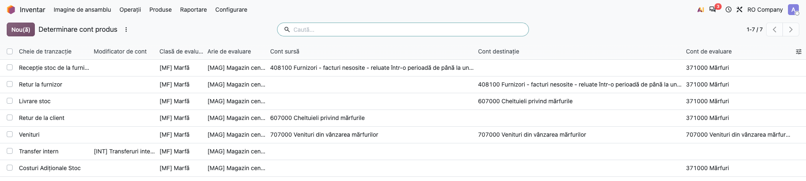
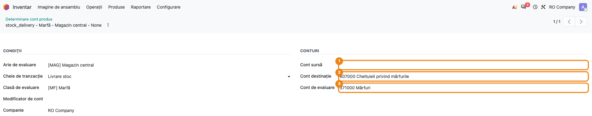
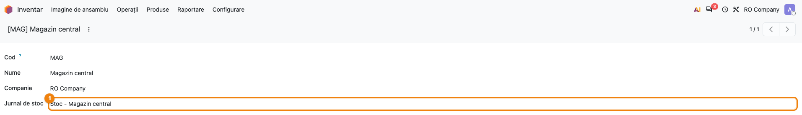
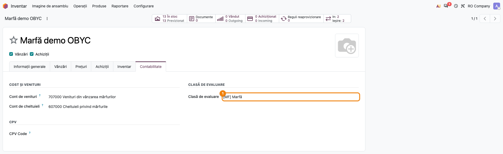
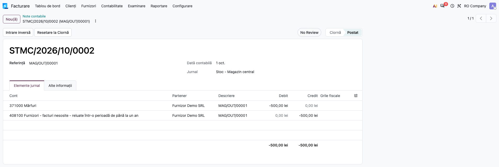
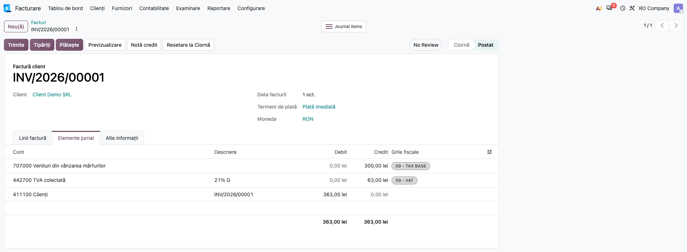
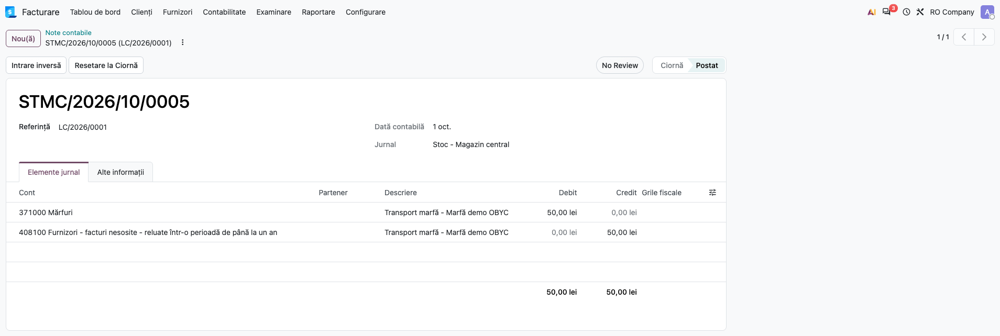

# Fișă Modul: Determinarea conturilor de stoc (OBYC)

**Modul:** `deltatech_obyc`
**Utilizator principal:** Contabil (gestiune, venituri/cheltuieli), consultant de implementare, administrator Odoo
**Prioritate:** 🔴 Ridicată (schimbă conturile tuturor notelor de stoc ale produselor cu clasă de evaluare și momentul în care se înregistrează costul mărfii vândute)

---

## 1. Scop business

Modulul aduce în Odoo un mecanism de tip **OBYC** (determinarea automată a conturilor, după
modelul SAP): conturile notelor de stoc nu mai vin din categoria produsului, ci dintr-o
**matrice de reguli** stabilită de contabil. O regulă se alege după combinația:

- **cheie de tranzacție** (recepție, livrare, retur, transfer, inventar, producție, cost de achiziție, venit);
- **clasă de evaluare** a produsului (marfă, materie primă, produs finit, ambalaj etc.);
- **arie de evaluare** (companie, depozit sau locație, din modulul `deltatech_valuation_area`);
- **modificator de cont** (opțional, de pe tipul de operațiune sau de pe jurnal);
- **companie**.

Astfel, aceeași operațiune (de exemplu o livrare) poate merge pe conturi diferite pentru mărfuri
și pentru produse finite, sau pentru gestiuni diferite, fără categorii de produs duplicate.

**Decizie de model, diferită de Odoo 20 standard:** pentru produsele cu clasă de evaluare,
**costul mărfii vândute se înregistrează la livrare**, pe nota mișcării de stoc (cheia
**Livrare stoc**, de exemplu Dr 607 / Cr 371 la mărfuri, Dr 711 / Cr 345 la produse finite).
**Factura de vânzare conține doar venitul și TVA** (Dr 4111 / Cr 707 + 4427), fără linii de cost.
Odoo 20 standard, în evaluarea în timp real, înregistrează costul la postarea facturii; cu OBYC
acest lucru nu se mai întâmplă, ca să nu se dubleze costul. Produsele fără clasă de evaluare
rămân pe comportamentul standard Odoo (excepție: inversarea storno a retururilor, OBYC-007).

**Valoarea ieșirilor rămâne cea de la validare.** Odoo 20 reia valorizarea și rescrie valoarea
ieșirilor deja validate când o intrare se mută în trecut, când se editează cantitatea unei mișcări
validate sau când o factură de furnizor reevaluează o recepție. Notele OBYC sunt postate la
validare și nu se rescriu, de aceea, pentru produsele cu clasă de evaluare, valoarea **ieșirilor**
deja validate rămâne cea din momentul validării (ca în versiunile anterioare), cât timp setarea
companiei **Păstrează valoarea mișcării la recalcularea retroactivă** este bifată (implicit).
**Intrarea** reevaluată (factură de furnizor cu alt preț, cantitate editată pe o recepție validată)
își schimbă însă valoarea **fără notă OBYC** pentru diferență — vezi secțiunea 9.

## 2. Bază legală și context

- **OMFP 1802/2014, pct. 95, 283, 290 și 440–441** — bunurile se scot din gestiune la transferul
  controlului către client, care, de regulă, coincide cu livrarea, nu cu facturarea. Pe această
  bază costul mărfii vândute se înregistrează la livrare.
- **Contabilitate storno** (înregistrarea în roșu): retururile se înregistrează cu sume negative
  pe conturile tranzacției inițiale, ca rulajele conturilor să nu crească artificial. La companiile
  cu țara fiscală România, Odoo activează **Contabilitate storno** implicit; variantele „fără
  storno" din fișă apar doar dacă bifa este scoasă.
- Cazurile pe care modelul „cost la livrare" **nu** le acoperă încă (livrat nefacturat la sfârșit
  de lună, consignație, factură înainte de livrare) sunt descrise la secțiunea 9 și în
  `readme/bugs.md`, cu temeiul legal aferent.

## 3. Utilizatori și roluri

- **Contabil** — definește clasele de evaluare, modificatorii de cont și matricea de reguli;
  verifică notele generate.
- **Gestionar / operator depozit** — validează recepții, livrări, retururi; nu configurează nimic,
  dar notele se generează la validarea documentelor lui.
- **Operator facturare** — emite facturile de vânzare; vede că factura nu mai conține liniile de cost.

**Atenție la drepturi:** modulul nu restrânge configurarea la contabil — clasele de evaluare,
modificatorii de cont și matricea de reguli pot fi create și modificate de orice utilizator intern,
iar meniul **Configurare determinare cont** nu are restricție de grup. Dacă matricea trebuie
protejată, restricționați manual meniul sau drepturile de acces (de exemplu la grupul
Contabilitate: Contabil).

Roluri recomandate pentru testare:
- Administrator funcțional (Inventar: Administrator, Contabilitate: Contabil) — configurarea din
  secțiunea 5; câmpul **Clasă de evaluare** de pe produs e vizibil doar utilizatorilor cu drepturi
  contabile;
- Utilizator operațional (Inventar: Utilizator) — recepția, livrarea, returul;
- Contabil — verificarea notelor și a facturilor.

## 4. Conturi și date implicate

Conturi folosite în exemplele din fișă (planul de conturi RO):

| Cont | Rol în fluxul OBYC |
|---|---|
| 371 Mărfuri | cont de evaluare (stocul) pentru clasa „Marfă" |
| 345 Produse finite | cont de evaluare pentru clasa „Produs finit" |
| 408 Furnizori - facturi nesosite | contrapartida recepției și a returului la furnizor; în exemplul de cost de achiziție, cont de decontare al facturii de transport |
| 607 Cheltuieli privind mărfurile | costul mărfii vândute, înregistrat la livrare |
| 711 Venituri aferente costurilor stocurilor de produse | costul produselor finite livrate |
| 707 Venituri din vânzarea mărfurilor | venitul de pe factura de vânzare |
| 4111 Clienți, 4427 TVA colectată | factura de vânzare |
| 401 Furnizori, 4426 TVA deductibilă | factura de furnizor (în afara OBYC, din taxe) |

**Cum se citesc conturile unei reguli** (comportamentul din cod, important la configurare):

*Nota mișcării de stoc* (recepție, livrare, retur, transfer, inventar, producție, livrare directă):

| Cont sursă al regulii | Nota generată |
|---|---|
| completat | Dr **Cont de evaluare** / Cr **Cont sursă** (Contul destinație nu se folosește) |
| gol | Dr **Cont destinație** / Cr **Cont de evaluare** |
| toate cele trei conturi goale | nu se generează notă |

*Linia de produs de pe factură* (regula **Venituri** la vânzare, **Recepție stoc de la furnizor**
la cumpărare): comportamentul urmărit este linie în credit (factură client) → **Cont destinație**,
linie în debit (factură de furnizor, notă de credit client) → **Cont sursă**. **Efectiv azi**, din
cauza limitării OBYC-001 (secțiunea 9), linia rămâne pe **Contul de evaluare** al regulii. Până
la rezolvare, la regula **Venituri** completați 707 în toate cele trei câmpuri (ca în baza demo),
astfel încât factura de vânzare să ajungă pe 707.

*Costul de achiziție (landed cost)*: Dr **Cont de evaluare** al regulii **Costuri Adiționale
Stoc** / Cr contul completat pe linia de cost; Contul sursă și Contul destinație nu se folosesc.

Date minime pentru demo:
- companie românească („RO Company"), în RON, cu planul de conturi RO și evaluare în timp real;
- o arie de evaluare (aici „[MAG] Magazin central"), cu jurnal de stoc propriu;
- o clasă de evaluare („[MF] Marfă") și, opțional, un modificator de cont;
- un produs stocabil cu clasa de evaluare completată, categorie cu evaluare în timp real și cost
  mediu (costurile de achiziție cer cost mediu sau FIFO și se contabilizează doar în timp real);
  nota OBYC a mișcărilor de stoc se generează pentru orice produs cu clasă de evaluare, indiferent
  de metoda de evaluare a categoriei (vezi secțiunea 9);
- un furnizor și un client.

## 5. Configurare inițială

1. **Activați aria de evaluare pe companie:** *Inventar → Configurare → Setări*, blocul
   **Evaluare** → bifați **Folosește zonă de evaluare** și alegeți **Aria de evaluare** a companiei.
   Fără arie de evaluare activă, regulile se caută cu aria goală.
2. **Creați ariile de evaluare:** *Inventar → Configurare → Gestiunea depozitului → Zonă de evaluare*.
   Dacă notele de stoc ale unei arii trebuie să meargă pe un jurnal dedicat, completați
   **Jurnal de stoc**. Aria se poate pune și pe depozit sau pe locație (prioritate: locația
   internă, apoi depozitul, apoi compania).
3. **Definiți clasele de evaluare:** *Inventar → Configurare → Configurare determinare cont →
   Clasă de evaluare* (cod + nume, afișate ca `[COD] Nume`).
4. **Definiți modificatorii de cont (opțional):** *Inventar → Configurare → Configurare determinare
   cont → Modificatori de cont*. Se pun pe **tipul de operațiune** (câmpul **Modificator de cont**,
   lângă depozit) pentru mișcările de stoc și pe **jurnal** (câmpul **Modificator de cont**, lângă
   companie) pentru costurile de achiziție validate pe acel jurnal. Pe facturi modificatorul nu se
   folosește. Exemplu: modificatorul „[INT] Transferuri interne" pe tipul de operațiune de transfer
   intern, cu o regulă proprie.
5. **Completați clasa pe produse:** pe produs, tabul **Contabilitate**, grupul **Clasă de evaluare**.
6. **Creați matricea de reguli:** *Inventar → Configurare → Configurare determinare cont →
   Determinare cont produs*. Pentru fiecare combinație folosită (cheie, clasă, arie, modificator)
   completați conturile după convenția din secțiunea 4. Exemplu pentru mărfuri:

   | Cheie de tranzacție | Cont sursă | Cont destinație | Cont de evaluare | Nota rezultată |
   |---|---|---|---|---|
   | Recepție stoc de la furnizor | 408 | — | 371 | Dr 371 / Cr 408 |
   | Retur la furnizor | — | 408 | 371 | Dr 408 / Cr 371 (cu storno: Dr 371 −V / Cr 408 −V) |
   | Livrare stoc | — | 607 | 371 | Dr 607 / Cr 371 |
   | Retur de la client | 607 | — | 371 | Dr 371 / Cr 607 (cu storno: Dr 607 −V / Cr 371 −V) |
   | Venituri | 707 | 707 | 707 | factură: Cr 707 (vezi atenționarea din secțiunea 4) |
   | Costuri Adiționale Stoc | — | — | 371 | Dr 371 / Cr contul liniei de cost |
   | Livrare directă (dropship) | 408 | — | 607 | Dr 607 / Cr 408 |
   | Retur dropshipping (client → furnizor) | 607 | — | 408 | Dr 408 / Cr 607 (cu storno: Dr 607 −V / Cr 408 −V) |
   | Transfer intern (aceeași arie) | — | — | — | fără notă (valoarea stocului nu se schimbă) |
   | Lipsă la inventar (gestiune → inventar) — cheia **Ajustare inventar plus** | — | 607 | 371 | Dr 607 / Cr 371 |
   | Plus la inventar (inventar → gestiune) — cheia **Ajustare inventar minus** | 607 (sau alt cont stabilit prin politica contabilă) | — | 371 | Dr 371 / Cr 607 |

   Pentru produse finite, regula **Livrare stoc** are Cont destinație 711 și Cont de evaluare 345
   (Dr 711 / Cr 345). Sensul inversat al cheilor de ajustare de inventar este o limitare a codului
   (OBYC-005, secțiunea 9); conturile pentru lipsuri și plusuri le stabilește contabilul.
7. **Storno:** *Facturare (sau Contabilitate) → Configurare → Setări*, blocul **Contabilitate
   storno** → verificați că **Contabilitate storno** este bifat (la firmele RO este bifat implicit).
8. **Valoarea mișcărilor validate:** *Inventar → Configurare → Setări*, blocul **Evaluare** →
   lăsați bifat **Păstrează valoarea mișcării la recalcularea retroactivă** (implicit bifat, din
   `deltatech_valuation_area`). Bifat: ieșirile validate ale produselor cu clasă de evaluare
   păstrează valoarea de la validare, aceeași cu cea din nota OBYC (intrările reevaluate se
   modifică totuși, fără notă — secțiunea 9). Debifat: recalcularea standard Odoo 20 rescrie
   valoarea ieșirilor ulterioare, dar notele contabile deja postate **nu** se corectează, deci
   valoarea stocului și contabilitatea se pot despărți.

Regula se caută **exact** pe combinația cheie + clasă + arie + modificator + companie: o regulă cu
modificator gol nu acoperă un tip de operațiune care are modificator. Dacă toate cele trei conturi
ale unei reguli sunt goale, mișcarea nu generează notă contabilă.

## 6. Flux de utilizare

### Pasul 1 — Matricea de reguli OBYC

*Inventar → Configurare → Configurare determinare cont → Determinare cont produs.*

Lista arată, pe fiecare rând, o regulă: cheia de tranzacție, modificatorul, clasa, aria și cele
trei conturi. Verificați că pentru fiecare operațiune pe care o veți face există un rând cu clasa
și aria produsului, iar conturile respectă convenția din secțiunea 4 (de exemplu la **Livrare
stoc** Contul sursă e gol, Contul destinație 607, Contul de evaluare 371).



### Pasul 2 — Formularul unei reguli

Deschideți din listă regula **Livrare stoc**. Grupul **Condiții** conține aria de evaluare, cheia
de tranzacție, clasa de evaluare, modificatorul de cont (aici gol) și compania; grupul **Conturi**
conține cele trei conturi (marcate ①②③):

1. **Găsiți pe ecran:** ① Cont sursă — gol; ② Cont destinație — 607000; ③ Cont de evaluare — 371000.
2. **Verificați:** fiindcă Contul sursă e gol, livrarea va genera Dr 607 / Cr 371 (convenția din
   secțiunea 4). Regula nu are modificator, deci se aplică doar tipurilor de operațiune fără
   modificator de cont.



### Pasul 3 — Clasele de evaluare

*Inventar → Configurare → Configurare determinare cont → Clasă de evaluare.*
Lista claselor de evaluare, cu codul și numele în coloane separate (aici MF, Marfă). În câmpurile
de selecție (produs, regulă) clasa apare ca `[COD] Nume`, de exemplu „[MF] Marfă".


### Pasul 4 — Aria de evaluare cu jurnal de stoc propriu

*Inventar → Configurare → Gestiunea depozitului → Zonă de evaluare* → deschideți aria.
Câmpul **Jurnal de stoc** (marcat) este completat cu „Stoc - Magazin central": notele OBYC ale
mișcărilor din această arie se postează pe acest jurnal, nu pe jurnalul de stoc al companiei.



### Pasul 5 — Produsul cu clasă de evaluare

*Inventar → Produse → Produse* → deschideți produsul → tabul **Contabilitate**.
Câmpul **Clasă de evaluare** (marcat) este „[MF] Marfă". Fără clasă, produsul urmează fluxul
standard Odoo (conturile din categorie). Conturile de venituri/cheltuieli de pe produs nu sunt
folosite pentru produsele cu clasă de evaluare: contează doar matricea.



### Pasul 6 — Recepția de la furnizor și nota ei

*Inventar → Operații → Transferuri → Recepții* → **Validează** recepția de 10 buc. În baza demo
recepția e făcută fără comandă de achiziție, deci se valorizează la costul produsului (100 lei/buc.);
dintr-o comandă de achiziție valoarea vine din prețul comenzii.
Nota se găsește în *Facturare → Contabilitate → Note contabile* (aplicația se numește
*Contabilitate* când e instalată contabilitatea completă), după referința recepției; tabul
**Elemente jurnal**:

1. **Găsiți pe ecran:** jurnalul „Stoc - Magazin central" (jurnalul ariei), referința recepției,
   liniile 371000 Mărfuri (debit) și 408100 Furnizori - facturi nesosite (credit).
2. **Verificați:** Dr 371 = Cr 408 = 1.000,00 lei; conturile sunt cele din regula **Recepție stoc
   de la furnizor**, nu cele din categoria produsului; jurnalul este al ariei.


### Pasul 7 — Returul la furnizor cu storno (înregistrare în roșu)

Cu **Contabilitate storno** activ pe companie: din recepția validată, butonul **Retur**. În Odoo 20
nu mai apare fereastra de selecție: se deschide direct transferul de retur, în ciornă (în baza demo
cu referința MAG/OUT/00001). Completați cantitatea de 5 buc. (butonul **Retur toate** pune toată
cantitatea recepției) → **Validează**, apoi deschideți nota returului din *Note contabile*.

1. **Găsiți pe ecran:** aceleași conturi ca la recepție (371 pe debit, 408 pe credit), cu sume
   negative.
2. **Verificați:** Dr 371 = −500,00 lei, Cr 408 = −500,00 lei — nota apare „în roșu", nu ca o
   notă „neagră" inversată (Dr 408 / Cr 371). Fără storno, returul ar fi Dr 408 / Cr 371 cu sume
   pozitive.



### Pasul 8 — Livrarea la client: costul mărfii vândute

*Inventar → Operații → Transferuri → Livrări* → **Validează** livrarea (2 buc.), apoi deschideți
nota din *Note contabile*, după referința livrării.

1. **Găsiți pe ecran:** jurnalul ariei, referința livrării, liniile 607000 Cheltuieli privind
   mărfurile (debit) și 371000 Mărfuri (credit).
2. **Verificați:** Dr 607 = Cr 371 = 200,00 lei (2 buc. × costul mediu de 100 lei). **Costul
   mărfii vândute se înregistrează acum, la livrare**, din regula **Livrare stoc** — nu va mai
   apărea pe factură.


### Pasul 9 — Factura de vânzare: doar venit și TVA

*Facturare → Clienți → Facturi* → **Nou(ă)** → client „Client Demo SRL", produsul livrat,
2 buc. × 150 lei, TVA 21% → **Confirmă** → tabul **Elemente jurnal**.

1. **Găsiți pe ecran:** liniile 707000 Venituri din vânzarea mărfurilor (credit 300,00 lei),
   442700 TVA colectată (credit 63,00 lei) și 411100 Clienți (debit 363,00 lei).
2. **Verificați:** **nu există** linii 607/371 pe factură — costul a fost deja înregistrat la
   livrare (Pasul 8), deci nu se dublează. Venitul este pe 707, din regula **Venituri**.



### Pasul 10 — Costul de achiziție (landed cost) pe o recepție

*Inventar → Operații → Ajustări → Costuri adiționale* → document nou pe o recepție de 10 buc.,
**Jurnal**: „Stoc - Magazin central", linie „Transport marfă" de 50 lei cu contul 408100,
împărțire după cantitate → **Calculează** → **Validează**, apoi deschideți nota documentului.
Nota se postează pe jurnalul ales în document, nu pe jurnalul ariei (în baza demo cele două
coincid: „Stoc - Magazin central").

1. **Găsiți pe ecran:** liniile 371000 Mărfuri (debit) și contul liniei de cost (aici 408100,
   credit).
2. **Verificați:** Dr 371 = Cr 408 = 50,00 lei; contul de stoc vine din regula **Costuri Adiționale
   Stoc** (Contul de evaluare), contul de credit e cel completat pe linia de cost; valoarea
   recepției crește cu 50 lei. Toată marfa recepției este încă în stoc; dacă o parte ar fi fost
   deja livrată, Odoo capitalizează doar partea rămasă (vezi limitarea din secțiunea 9).



### Note de monografie și raportare

Note generate în baza demo (marfă, cost mediu 100 lei/buc.):

| Operațiune | Cheie de tranzacție | Debit | Credit | Sumă |
|---|---|---|---|---|
| Recepție de la furnizor (10 buc.) | Recepție stoc de la furnizor | 371 | 408 | 1.000,00 |
| Retur la furnizor (5 buc.), **fără** storno | Retur la furnizor | 408 | 371 | 500,00 |
| Retur la furnizor (5 buc.), **cu** storno | Retur la furnizor | 371 | 408 | −500,00 |
| Livrare la client (2 buc.) | Livrare stoc | 607 | 371 | 200,00 |
| Factura de vânzare (2 × 150 lei + TVA 21%) | Venituri | 4111 | 707 / 4427 | 363,00 = 300,00 + 63,00 |
| Retur de la client, **cu** storno (implicit la firmele RO) | Retur de la client | 607 | 371 | −V |
| Retur de la client, **fără** storno | Retur de la client | 371 | 607 | V |
| Cost de achiziție (transport) | Costuri Adiționale Stoc | 371 | contul liniei de cost (aici 408) | 50,00 |
| Livrare directă furnizor → client | Livrare directă | 607 | 408 | valoarea mișcării |
| Retur livrare directă (client → furnizor), **cu** storno | Retur dropshipping | 607 | 408 | −V |
| Retur livrare directă (client → furnizor), **fără** storno | Retur dropshipping | 408 | 607 | V |
| Livrare produse finite | Livrare stoc (clasa produs finit) | 711 | 345 | V |

Observații:
- **Livrarea directă (dropship)** generează notă cu valoare: mișcarea furnizor → client se
  valorizează (înainte nota ieșea cu 0). Livrarea directă nu modifică stocul propriu și nici
  costul mediu al produsului.
- **Liniile notelor de stoc** poartă produsul, **cantitatea semnată** (pozitivă pe debit,
  negativă pe credit; la storno semnul se inversează odată cu suma) și unitatea de măsură —
  necesare evaluării cantitativ-valorice din `deltatech_stock_valuation`.
- **Storno** se aplică doar mișcărilor de retur (cele care au o mișcare de origine returnată):
  nota „neagră" a regulii de retur devine tranzacția inițială cu sume negative. De aceea regula
  de retur trebuie să fie oglinda regulii operațiunii inițiale.
- **Factura de furnizor:** linia de produs se caută în regula **Recepție stoc de la furnizor**.
  Comportamentul urmărit este linie în debit → Cont sursă (408), adică Dr 408 + Dr 4426 = Cr 401
  (linia de TVA vine din taxă, OBYC nu o schimbă); în prezent, din cauza limitării OBYC-001, linia
  de produs rămâne pe Contul de evaluare (371) — verificați contul înainte de confirmare.
- **Valoarea mișcării în Odoo 20:** în Odoo 20 câmpul de valoare al mișcării de stoc este
  **negativ pe ieșiri** (livrare, retur la furnizor) și pozitiv pe intrări. Nota OBYC folosește
  valoarea absolută, deci sumele Dr/Cr sunt pozitive, ca în tabelul de mai sus. Semnul negativ
  apare doar în rapoartele de stoc, nu în note.
- **Recalcularea retroactivă:** cu setarea **Păstrează valoarea mișcării la recalcularea
  retroactivă** bifată, o recepție mutată în trecut, o cantitate editată pe o mișcare validată sau
  o factură de furnizor cu alt preț nu modifică valoarea livrărilor deja validate ale produselor
  cu clasă de evaluare; valoarea lor rămâne egală cu nota OBYC. **Recepția** însă se reevaluează:
  de exemplu, o factură de furnizor la 120 lei/buc. pentru recepția de 10 buc. × 100 lei ridică
  valoarea recepției la 1.200 lei, în timp ce nota OBYC a recepției rămâne Dr 371 / Cr 408 =
  1.000 lei. Diferența de 200 lei nu se înregistrează automat (secțiunea 9).
- **TVA aferentă facturilor nesosite** (Dr 4428 / Cr 408 la recepție) nu este tratată de OBYC; se
  înregistrează separat, după politica contabilă a firmei.

## 7. Legături cu alte module / declarații

| Modul | Rol |
|---|---|
| `deltatech_valuation_area` | ariile de evaluare (companie/depozit/locație), jurnalul de stoc pe arie și setarea **Păstrează valoarea mișcării la recalcularea retroactivă** — dependență obligatorie |
| `stock_account` | evaluarea în timp real; OBYC înlocuiește conturile notelor de stoc pentru produsele cu clasă |
| `stock_landed_costs` | costurile de achiziție; OBYC dă contul de stoc prin cheia **Costuri Adiționale Stoc** |
| `purchase_stock` | recepțiile din comenzi de achiziție |
| `deltatech_stock_valuation` | (opțional) evaluarea cantitativ-valorică pe arie, construită din liniile notelor OBYC |
| `account` (storno) | înregistrarea în roșu a retururilor |
| Jurnalul de TVA / D300 | factura de vânzare rămâne sursa TVA colectate; OBYC nu schimbă taxele |

**Ce e automat:**
- alegerea regulii și a conturilor la fiecare mișcare de stoc a unui produs cu clasă de evaluare;
- jurnalul notelor de stoc (jurnalul ariei, dacă e completat); costul de achiziție se postează pe
  jurnalul ales în documentul Costuri adiționale;
- costul mărfii vândute la livrare și lipsa liniilor de cost pe factura de vânzare;
- inversarea în roșu a retururilor, cu storno activ;
- valorizarea mișcărilor de livrare directă;
- păstrarea valorii de la validare pentru ieșirile produselor cu clasă de evaluare, la
  recalcularea retroactivă din Odoo 20 (cu setarea bifată).

**Ce rămâne manual:**
- întreținerea matricei de reguli (o regulă lipsă blochează validarea documentului);
- veniturile pentru livrările nefacturate la sfârșit de lună (418), consignația și facturile
  emise înainte de livrare (secțiunea 9);
- alegerea contului de pe linia de cost la costurile de achiziție și tratarea părții deja livrate;
- verificarea contului liniei de produs pe factura de furnizor (OBYC-001);
- nota pentru diferența de valoare a unei recepții reevaluate (factură de furnizor cu alt preț,
  cantitate editată), secțiunea 9;
- restricționarea drepturilor de modificare a matricei (secțiunea 3).

## 8. Verificări pentru consultant

- [ ] produsul are **Clasă de evaluare** (tabul Contabilitate) și categorie cu evaluare în timp real
- [ ] compania are **Folosește zonă de evaluare** bifat și o arie de evaluare; aria are **Jurnal de stoc**, dacă se dorește jurnal separat
- [ ] există regulă pentru fiecare combinație cheie + clasă + arie + modificator folosită (inclusiv tipurile de operațiune cu modificator)
- [ ] conturile regulilor respectă convenția: Cont sursă completat → Dr evaluare / Cr sursă; Cont sursă gol → Dr destinație / Cr evaluare
- [ ] nota recepției: Dr 371 / Cr 408, pe jurnalul ariei
- [ ] nota livrării: Dr 607 / Cr 371 (sau Dr 711 / Cr 345 la produse finite), la data livrării
- [ ] factura de vânzare: Dr 4111 / Cr 707 + 4427, **fără** linii 607/371
- [ ] factura cu două sau mai multe produse OBYC (clase diferite) se confirmă, fiecare linie pe contul clasei ei
- [ ] linia de produs de pe factură este pe contul de venit, nu pe contul de stoc (OBYC-001)
- [ ] cu **Contabilitate storno** activ, nota returului are sume negative pe **aceleași conturi** ca operațiunea inițială
- [ ] costul de achiziție: Dr 371 / Cr contul liniei de cost; valoarea recepției crește cu suma costului
- [ ] livrarea directă furnizor → client are notă cu valoare (nu 0) și nu modifică stocul propriu
- [ ] liniile notelor de stoc au produs, cantitate semnată (pozitivă pe debit, negativă pe credit) și unitate de măsură
- [ ] la ajustările de inventar, sensul cheilor plus/minus a fost verificat pe o mișcare reală (OBYC-005)
- [ ] costul de achiziție este pe jurnalul ales în document; recepția avea toată marfa în stoc sau partea livrată a fost tratată manual
- [ ] setarea **Păstrează valoarea mișcării la recalcularea retroactivă** este bifată (Inventar → Configurare → Setări, blocul Evaluare)
- [ ] după mutarea în trecut a unei recepții, valoarea livrărilor validate ulterior nu s-a schimbat și este egală cu suma din nota lor OBYC
- [ ] după o factură de furnizor cu alt preț decât recepția, diferența a fost înregistrată manual (în stoc → 371, livrat → 607/711); soldul 371 = valoarea stocului din Odoo minus partea din diferență aferentă cantității deja livrate (aceasta rămâne în valoarea din Odoo, fiindcă ieșirile validate nu se reevaluează)
- [ ] returul unei livrări directe (client → furnizor), cu storno activ, are Dr 607 −V / Cr 408 −V
- [ ] drepturile de modificare a matricei de reguli sunt restrânse, dacă politica firmei o cere

## 9. Mesaje de eroare frecvente

| Mesaj | Cauză | Remediere |
|---|---|---|
| „Nu s-a găsit nicio regulă de determinare a contului pentru cheia de tranzacție '…', modificatorul de cont '…', clasa de evaluare '…', zona de evaluare '…' și compania '…'." | nu există regulă pentru combinația exactă (adesea: tipul de operațiune are modificator, iar regula nu); numele cheii apare în engleză | butonul **Mergi la configurare** deschide lista de reguli; la **Nou(ă)** condițiile vin precompletate — adăugați conturile și salvați |
| „Cheia de tranzacție nu a putut fi determinată pentru mișcarea de la {source_usage} la {dest_usage}." | mișcare între tipuri de locații pe care modulul nu le cunoaște (de exemplu tranzit → client); acoladele rămân în text, fără tipurile de locații (defect de afișare) | refaceți fluxul prin locații interne sau cereți extinderea cheilor |
| „Zona de evaluare nu este definită" | compania folosește arii de evaluare, dar nici compania, nici depozitul, nici locația nu au arie | completați aria pe companie, depozit sau locație |
| „Locațiile sursă și destinație trebuie să aibă aceeași zonă de evaluare pentru mișcările interne." | transfer intern între locații din arii diferite | folosiți un transfer prin tranzit (chei **Ieșire / Intrare transfer intern**) |
| „Cheia de tranzacție nu este definită. Setați-o în context." | un flux standard cere conturile unui produs cu clasă de evaluare fără să treacă prin OBYC | semnalați fluxul echipei de dezvoltare; temporar, procesați produsul fără clasă |

**Limitări cunoscute** (detaliate în `readme/bugs.md`; nu sunt funcționalități):

- **OBYC-001 — linia de produs de pe factură ia Contul de evaluare.** La crearea facturii, contul
  liniei se alege înainte de completarea sumei, deci rămâne pe Contul de evaluare al regulii:
  venitul facturii de vânzare poate ajunge pe 371 în loc de 707, iar factura de furnizor pe 371
  în loc de 408. Nota este echilibrată, deci nu apare nicio eroare. Ocolire pentru vânzări:
  completați 707 în toate cele trei conturi ale regulii **Venituri**. Pentru facturile de furnizor
  nu există ocolire prin configurare — verificați contul liniei înainte de confirmare.
- **OBYC-002 — fără venituri de facturat (418 Clienți – facturi de întocmit) pentru livrat
  nefacturat.** Livrarea din luna M înregistrează costul în M, venitul apare doar la factura din
  M+1. La sfârșitul lunii M se înregistrează manual Dr 418 = Cr 707 + Cr 4427 (sau Cr 4428, urmat
  în aceeași lună de Dr 4428 / Cr 4427), ca TVA-ul livrării să intre în D300 din M; 4428 rămâne
  nestins doar la firmele cu TVA la încasare. La factura din M+1: Dr 4111 / Cr 418. Tratamentul TVA
  depinde de politica contabilă a clientului și se verifică cu contabilul.
- **OBYC-003 — consignație, bunuri trimise spre probă sau păstrate la dispoziția clientului.**
  Orice ieșire spre o locație de client folosește **Livrare stoc** și înregistrează costul imediat
  (Dr 607 / Cr 371), deși controlul nu s-a transferat (corect: Dr 357 / Cr 371 la expediere în
  consignație). Aceste fluxuri se tratează manual.
- **OBYC-004 — factura emisă înainte de livrare.** O factură integrală (nu de avans) postată
  înainte de livrare înregistrează venitul pe 707, deși ar trebui tratată ca avans (Dr 4111 /
  Cr 419 + 4427). Folosiți facturi de avans până la livrare.
- **OBYC-005 — ajustări de inventar cu cheile inversate.** Ieșirea din gestiune spre locația de
  inventar (lipsă la inventar) folosește cheia **Ajustare inventar plus**, iar intrarea (plus la
  inventar) cheia **Ajustare inventar minus**. Configurați conturile după sensul real al mișcării
  (exemplul din secțiunea 5) și verificați pe o ajustare de test.
- **OBYC-006 — notă OBYC și pentru produsele fără evaluare în timp real.** Pentru un produs cu
  clasă de evaluare, nota mișcării se generează chiar dacă categoria are evaluare manuală. Puneți
  clasa de evaluare doar pe produse din categorii cu evaluare în timp real.
- **OBYC-007 — mesaje și exemple neclare.** Mesajul „Cheia de tranzacție nu a putut fi determinată…"
  afișează acoladele în loc de tipurile de locații; exemplele din descrierea tehnică a modulului
  (tabelul de mapări tipice) nu respectă convenția din secțiunea 4 — configurați după tabelul din
  secțiunea 5; titlul unei reguli arată cheia tehnică și „None" pentru modificator gol; inversarea
  storno a retururilor se aplică și produselor fără clasă de evaluare (caz rar; nota rămâne pe
  aceleași conturi, cu sume negative).
- **Setarea de păstrare a valorii debifată.** Dacă **Păstrează valoarea mișcării la recalcularea
  retroactivă** este debifată, recalcularea standard Odoo 20 rescrie valoarea livrărilor deja
  validate, dar notele OBYC postate rămân neschimbate: valoarea stocului și soldul 371 se pot
  despărți. Debifați setarea doar cu acordul contabilului și înregistrați manual diferențele.
- **Cost de achiziție pe marfă parțial livrată.** Odoo capitalizează pe 371 doar partea de cost
  aferentă cantității rămase în stoc; pentru partea deja livrată nu se face notă, deci suma rămâne
  în contul liniei de cost (în exemplu 408, care rămâne nestins). Înregistrați manual partea
  livrată pe 607/711 sau folosiți ca cont al liniei de cost un cont în care partea livrată poate
  rămâne, stabilit cu contabilul. Este comportamentul nucleului `stock_landed_costs`.
- **Diferența de preț / recepție reevaluată fără notă.** O factură de furnizor cu alt preț decât
  recepția, sau o cantitate editată pe o recepție validată, schimbă valoarea recepției în Odoo,
  dar OBYC nu postează nicio notă pentru diferență: valoarea stocului din Odoo nu mai corespunde
  soldului 371, iar dacă linia facturii este pe 408 (ocolirea OBYC-001), 408 rămâne nestins cu
  diferența. Înregistrați manual diferența: pentru partea aflată încă în stoc Dr 371 / Cr 408
  (sau invers, la preț mai mic; la o corectură de cantitate, contul stabilit de contabil, după
  cauza corecției), pentru partea deja livrată pe 607 (711 la produse finite), după politica
  contabilă a firmei. Partea livrată rămâne în valoarea stocului din Odoo (ieșirile validate nu se
  reevaluează), deci devine o diferență permanentă de reconciliere între valoarea stocului din
  Odoo și soldul 371; documentați-o la închiderea lunii. Exemplu: recepție 10 × 100, livrare 5,
  factură la 120 → valoarea din Odoo 1.200 − 500 = 700; după nota manuală (Dr 371 100 pentru
  stoc, Dr 607 100 pentru livrat / Cr 408 200), soldul 371 = 600; diferența de 100 este partea
  livrată. Cheile **Evaluare stoc**, **Diferență de preț** și **Diferență de
  preț la recepție stoc** apar în listă, dar nu sunt folosite de fluxurile actuale.

## 10. Capturi de ecran

Capturile sunt generate automat de testul `tests/test_screenshots.py` (mixinul `ScreenshotCase`
din `l10n_ro_doc_screenshots`, import defensiv), pe „RO Company", în RON, în limba română, pe
planul de conturi RO. Testul verifică întâi notele contabile (conturi și sume) și abia apoi
capturează ecranele. Se regenerează cu:

```bash
.venv/bin/python odoo/odoo-bin -c odoo.conf -d test20 -i deltatech_obyc,l10n_ro,l10n_ro_doc_screenshots \
    --test-tags=fise_screenshots --stop-after-init --http-port=8070
```

| Fișier | Conținut |
|---|---|
| `01_account_determination_matrix.png` | matricea de reguli OBYC (Determinare cont produs) |
| `02_account_determination_form.png` | formularul regulii Livrare stoc: Condiții și Conturi (①②③) |
| `03_valuation_class_list.png` | lista claselor de evaluare |
| `04_valuation_area_journal.png` | aria de evaluare cu Jurnal de stoc propriu |
| `05_product_valuation_class.png` | produsul cu Clasă de evaluare (tab Contabilitate) |
| `06_stock_move_obyc_entry.png` | nota recepției: Dr 371 / Cr 408, pe jurnalul ariei |
| `07_storno_return.png` | returul la furnizor cu storno: Dr 371 −500 / Cr 408 −500 |
| `08_delivery_cogs_entry.png` | nota livrării: Dr 607 / Cr 371 (costul la livrare) |
| `09_sale_invoice_no_cogs.png` | factura de vânzare: Dr 4111 / Cr 707 + 4427, fără linii de cost |
| `10_landed_cost_entry.png` | nota costului de achiziție: Dr 371 / Cr contul liniei de cost |

## 11. Observații pentru manual

- Păstrați explicit **decizia „costul la livrare"** și diferența față de Odoo standard: cititorii
  care cunosc Odoo vor căuta liniile de cost pe factură.
- Tabelul cu **convenția de citire a conturilor** (secțiunea 4) este esențial: numele câmpurilor
  („sursă", „destinație") nu spun singure ce cont se debitează.
- Limitările OBYC-001…007 trebuie prezentate ca atare, cu procedura manuală, până la rezolvarea
  lor; reverificați `readme/bugs.md` înainte de fiecare ediție a manualului.
- Etichetele din interfață sunt în română („Zonă de evaluare" în meniu, „Arie de evaluare" pe
  câmpuri); titlul formularului unei reguli afișează cheia tehnică și „None" pentru modificator gol
  (de exemplu `stock_delivery - Marfă - Magazin central - None`).
- În Odoo 20, butonul **Retur** creează direct transferul de retur (fără fereastra de selecție
  a cantităților din versiunile anterioare); descrieți fluxul de retur ca atare.
- Unele etichete din nucleul Odoo apar netraduse sau ciudat traduse în capturi (grilele fiscale
  „09 - TAX BASE", „09 - VAT", „Intrare inversă", „No Review", „Journal Items", „0 Outgoing",
  „0 Incoming", „CPV Code"); nu țin de acest modul.
