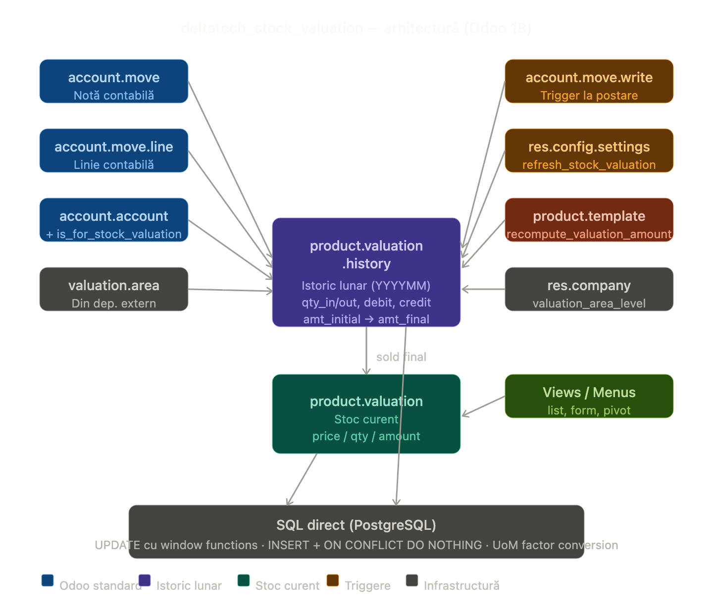

## Product Stock Valuation

Modul pentru calculul și urmărirea evaluării stocului de produse pe arie de evaluare și cont contabil,
inspirat din conceptul SAP Material Valuation (MBEW & MBEWH).



### Funcționalități principale

- **Cost mediu ponderat** calculat per produs, arie de evaluare și cont contabil
- **Evaluare din note contabile** — valorile sunt determinate direct din înregistrările contabile, nu din mișcările de stoc
- **Actualizare live la postare** — la postarea unei note contabile, evaluarea curentă și istoricul lunar sunt recalculate automat pentru liniile aferente
- **Istoric lunar** al evaluărilor (`product.valuation.history`) pentru urmărirea evoluției în timp
- **Conturi contabile dedicate** — se marchează conturile utilizate la evaluarea stocului (`is_for_stock_valuation`)
- **Validare inteligentă** — aria de evaluare devine obligatorie pe liniile contabile doar pentru conturile marcate pentru evaluare stoc
- **Configurare nivel arie de evaluare** per companie (ex. nivel companie)
- **Recalculare manuală** a evaluărilor din interfața de configurare (doar pentru administratori de sistem), pas cu pas sau automat (cron)
- **Descărcare de gestiune la cost mediu** — opțional, ieșirile din stoc pot fi valorizate la prețul din `product.valuation` (câmpul `use_valuation_area_price` pe categoria de produse), în locul prețului standard

### Modele introduse

- `product.valuation` — evaluarea curentă a unui produs pe arie de evaluare, cont și companie (preț, cantitate, valoare)
- `product.valuation.history` — istoricul lunar al evaluărilor (cantitate inițială, intrări, ieșiri, finală și valori aferente)

### Modele extinse

- `account.account` — adăugat câmpul `is_for_stock_valuation` pentru a marca conturile ce participă la evaluare
- `account.move.line` — extinsă metoda `_is_valuation_area_required` pentru a impune aria de evaluare doar pe conturile de stoc marcate
- `account.move` — la postare (`_recompute_valuation`) recalculează automat evaluarea curentă și istoricul lunar
- `product.category` — adăugat câmpul `use_valuation_area_price` (incompatibil cu metoda FIFO) pentru a valoriza ieșirile la costul mediu din `product.valuation`
- `stock.move` — extinsă metoda `_get_price_unit` pentru a prelua prețul de descărcare din `product.valuation` la ieșirile din stoc intern

### Inițializare

La prima instalare sau după import de date, este necesară recalcularea completă a evaluărilor.
Aceasta se face din **Setări → Stock Valuation** (buton de refresh pas cu pas sau refresh automat),
disponibilă doar pentru administratorul de sistem. Programatic:

```python
# Reconstruiește istoricul lunar din notele contabile, apoi evaluarea curentă
env["product.valuation.history"]._recompute_all_amount()
env["product.valuation"]._recompute_all_amount()
```

### Evaluare în paralel cu Odoo standard

Modulul nu înlocuiește mecanismul standard Odoo (`stock_account`), ci adaugă un strat suplimentar de raportare
**garantat consistent cu balanța contabilă**, util în contexte cu ajustări contabile manuale sau cerințe de
raportare pe centre de cost/depozite.

| Aspect | Standard Odoo (≤18) | Standard Odoo 19 | deltatech_stock_valuation |
|---|---|---|---|
| Sursă date | `stock.valuation.layer` | `stock.move` | `account.move.line` |
| Granularitate | Per produs | Per produs | Per produs + arie + cont |
| Sincronizare cu contabilitatea | Parțială | Parțială | Completă (prin definiție) |
| Istoric | Per tranzacție | Per mișcare stoc | Lunar agregat |

> **Notă Odoo 19:** Modelul `stock.valuation.layer` a fost eliminat în Odoo 19. Evaluarea stocului standard se bazează acum direct pe `stock.move`. Modulul `deltatech_stock_valuation` rămâne independent de această schimbare, deoarece folosește `account.move.line` ca sursă de adevăr.

### Limitări

> ⚠️ **Limitare:** Modulul suportă exclusiv metoda de evaluare **AVCO (cost mediu ponderat)**. Nu este compatibil cu produsele configurate cu metoda **FIFO**. Utilizarea cu produse FIFO va produce rezultate incorecte.

Metoda FIFO necesită urmărirea fiecărui strat de cost individual (ce unități au intrat când și la ce preț), informație care se pierde prin agregarea contabilă folosită de acest modul.

| Aspect | AVCO | FIFO |
|---|---|---|
| Sursă necesară | Agregate contabile | Straturi individuale per intrare |
| Compatibil cu `account.move.line` agregat | ✅ Da | ❌ Nu |
| Compatibil cu `deltatech_stock_valuation` | ✅ Da | ❌ Nu |

### Dependențe

- `stock_account` — evaluare stoc standard Odoo
- `deltatech_valuation_area` — definirea ariilor de evaluare

### Testare

Testele automate (tag `deltatech_stock_valuation`) acoperă principalele cerințe ale modulului:

- **Flux pe documente** (`TestStockValuation`): recepție cu factură (produs nou → linie nouă în
  `product.valuation` + `product.valuation.history`), retur la furnizor (`in_refund`), ieșire pe
  factură client (`out_invoice`), retur de la client (`out_refund`), cost mediu ponderat pe mai
  multe recepții, propagarea soldurilor între luni și produse ne-stocabile.
- **Pricing și constrângeri** (`TestValuationPricing`): descărcarea la prețul din `product.valuation`
  pentru ieșiri interne, fallback la prețul standard, ignorarea la intrări și incompatibilitatea cu FIFO.
- **Recalculare** (`TestRecomputeValuation`, `TestRecomputeProductTemplate`, `TestRefreshStockValuation`):
  recalcularea pe o înregistrare, recalcularea globală și refresh-ul pas cu pas.
- **Configurare** (`TestConfigSettings`): refresh/recompute restricționat la administrator, resetarea
  pasului și pornirea/oprirea refresh-ului automat (cron).

```bash
./odoo/odoo-bin -c odoo18.conf -d o18_test -u deltatech_stock_valuation \
    --test-tags=deltatech_stock_valuation --stop-after-init
```
