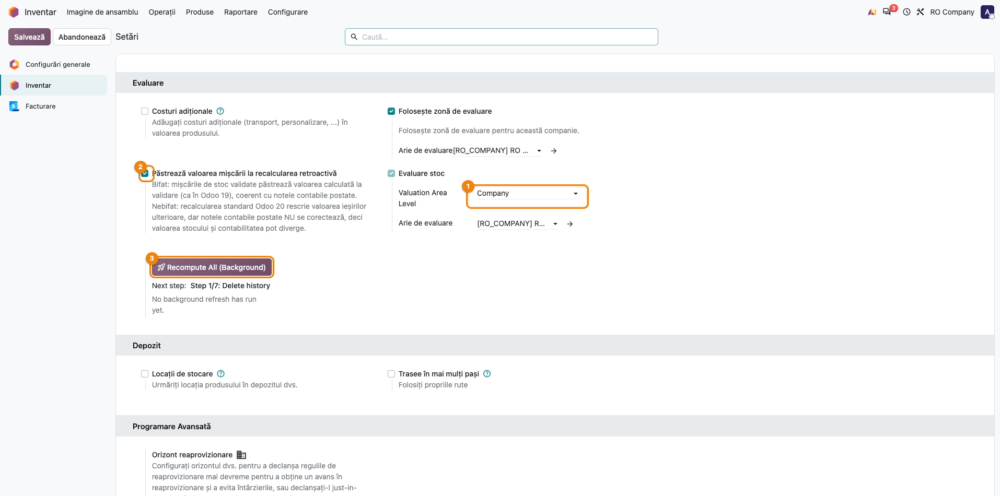
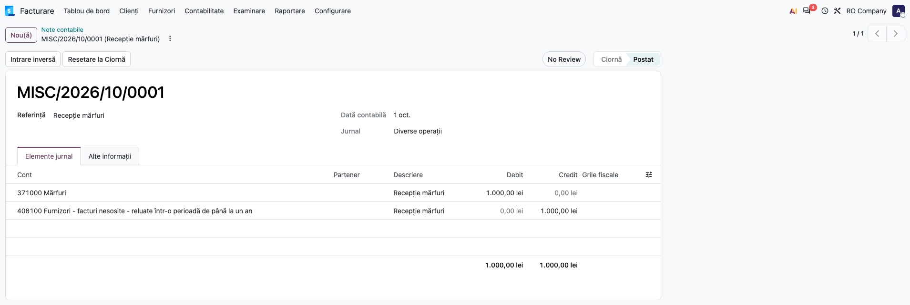
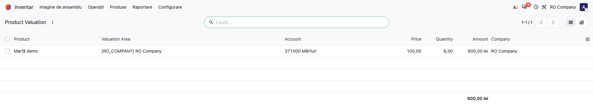
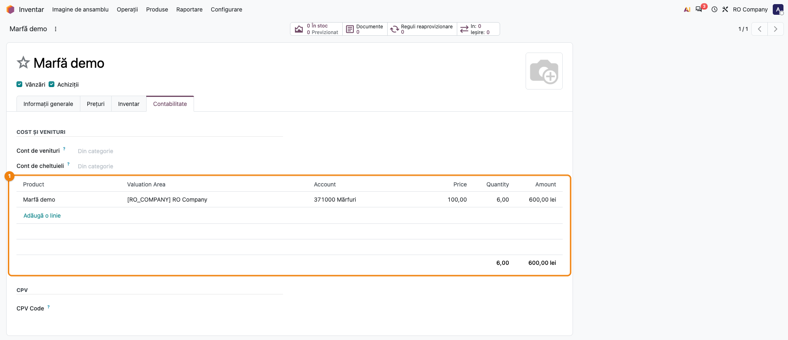

# Fișă Modul: Evaluarea stocului din notele contabile (produs × arie × cont)

**Modul:** `deltatech_stock_valuation`
**Utilizator principal:** contabil stocuri, controller, administrator Odoo (recalcularea)
**Prioritate:** 🟡 Medie (strat de control peste evaluarea standard; necesar la clienții cu arii de evaluare sau cu corecții contabile manuale pe stocuri)

> Fișă adusă pe Odoo 20 la 01.10.2026, pornind de la fișa versiunii 19.0 (structura cu 11
> secțiuni), pe codul versiunii 20.0.0.0.9 a modulului.

---

## 1. Scop business

Modulul adaugă un strat de evaluare a stocului **paralel** cu mecanismul standard Odoo. În loc să
pornească de la mișcările de stoc, reconstruiește cantitatea și valoarea din **liniile contabile
postate** de pe conturile de stoc marcate pentru evaluare (de exemplu 371 Mărfuri). Rezultatul se
ține pe combinația **produs × arie de evaluare × cont contabil × companie**, în două tabele:

- **Product Valuation** (`product.valuation`) — soldul curent: preț, cantitate, valoare;
- **Product Valuation History** (`product.valuation.history`) — istoricul lunar: sold inițial,
  intrări, ieșiri, debit, credit, sold final.

Pentru că sursa este contabilitatea, evaluarea pe produse se poate pune lângă balanță cont cu
cont. Conceptul este cel din SAP Material Valuation (MBEW / MBEWH). Opțional, ieșirile din stoc se
pot valoriza la prețul calculat de modul pe aria de evaluare, în loc de prețul standard.

Este util când:

- vreți să confruntați stocul pe produse cu soldul conturilor de stoc;
- aveți nevoie de raportare pe arii de evaluare;
- există corecții contabile manuale pe conturile de stoc și evaluarea trebuie să le urmeze exact;
- metoda de cost folosită este **AVCO** (cost mediu ponderat).

## 2. Bază legală și context

Modulul nu implementează o cerință legală anume și nu generează declarații. Sprijină controlul
concordanței dintre evidența cantitativ-valorică a stocurilor și conturile de stoc din balanță,
control pe care contabilul îl face la închiderea lunii și la inventariere.

Contextul de funcționare:

- Din Odoo 19 nu mai există straturi de evaluare (`stock.valuation.layer`); în **Odoo 20**
  evaluarea standard se calculează tot pe mișcarea de stoc. Modulul nu depinde de acest mecanism,
  pentru că citește notele contabile.
- **Odoo 20** schimbă două lucruri care contează doar pentru opțiunea **Use Valuation Area Price**
  (pasul 2): valoarea unei mișcări de **ieșire** se ține **cu minus**, iar o corecție retroactivă
  (dată schimbată, cantitate editată pe o mișcare efectuată, intrare revalorizată după ce stocul a
  fost deja descărcat) **reia valorizarea tuturor mișcărilor ulterioare** ale produsului, la costul
  mediu global. Cât de mult se păstrează din prețul ariei la o astfel de reluare decide setarea
  **Păstrează valoarea mișcării la recalcularea retroactivă** (secțiunea 5, pasul 3).
- Pe conturile de stoc apar linii cu produs doar dacă produsele au **evaluare perpetuă** (pe
  categorie, **Evaluare stocuri** = **Perpetual (at invoicing)**). La evaluarea **Periodic (at
  closing)**, modulul nu primește date din recepții, livrări sau facturi.
- **Cine postează pe 371** depinde de configurare:
  - cu `deltatech_obyc`: notele de stoc la validarea recepției (Dr 371 / Cr 408) și a livrării
    (Dr 607 / Cr 371) — **costul mărfii vândute se înregistrează la livrare**;
  - fără OBYC (Odoo 20 standard, perpetuă la facturare): recepția și livrarea **nu** postează note;
    intrarea apare pe **factura de furnizor** (Dr 371 + 4426 / Cr 401, la data facturii), iar ieșirea
    pe **factura de client** (liniile de cost Dr 607 / Cr 371, la data facturii). Mișcările din sau
    către o locație care are cont de evaluare (de exemplu ajustările de inventar sau rebuturile, pe
    locații configurate cu cont) postează însă note de stoc la validare și intră în evaluare.
  Modulul citește corect ambele variante (vezi pasul 4).

## 3. Utilizatori și roluri

| Rol | Ce face |
|---|---|
| Contabil stocuri | marchează conturile de evaluare, verifică notele de stoc, citește Product Valuation și Product Valuation History |
| Controller | confruntă evaluarea pe produse cu balanța (inclusiv cu raportul Stock Valuation Check, dacă e instalat) |
| Administrator de sistem | salvează setările de evaluare și pornește recalcularea completă — butoanele de recalculare cer grupul **Administrator de sistem** |

Roluri recomandate la testare: un utilizator **Administrator de sistem** cu drepturi de contabil
(pentru setări și recalculare) și un utilizator **contabil** fără drepturi de administrator, ca să
verificați că nu vede meniul **Setări**, deci nici recalcularea.

## 4. Conturi și date implicate

| Cont | Rol în flux |
|---|---|
| **371 Mărfuri** (sau orice cont de stoc din categoriile de produse) | cont de evaluare: bifa **Evaluare stoc** pe cont; singurele linii citite de modul |
| 408 Furnizori - facturi nesosite | contrapartida recepției fără factură, cu OBYC (Cr); fără efect asupra evaluării |
| 4428 TVA neexigibilă | TVA aferentă recepției fără factură (Dr 4428 / Cr 408); fără efect asupra evaluării |
| 401 Furnizori | contrapartida intrării pe factura de furnizor, fără OBYC (Cr); fără efect asupra evaluării |
| 607 Cheltuieli privind mărfurile | contrapartida ieșirii, la livrare (cu OBYC) sau pe factura de client (fără OBYC); fără efect asupra evaluării |

Date minime pentru demo:

- compania „RO Company", în RON, cu planul de conturi RO și **zona de evaluare** activă;
- o categorie de produs cu metoda de cost **Average Cost (AVCO)**, evaluare **Perpetual (at
  invoicing)** și cont de stoc 371;
- un produs stocabil în acea categorie;
- o notă de recepție (10 buc, 1.000 lei) și una de livrare (4 buc, 400 lei).

## 5. Configurare inițială

1. **Zona de evaluare** — în **Inventar → Configurare → Setări**, secțiunea **Evaluare**, bifați
   **Folosește zonă de evaluare** (vine din `deltatech_valuation_area`) și alegeți **Arie de
   evaluare** a companiei, sau lăsați câmpul gol: la salvare se creează automat aria companiei.
2. **Nivelul ariei** — în același bloc, la **Evaluare stoc**, setați **Valuation Area Level** =
   **Company**. Este singurul nivel pentru care recalcularea din interfață funcționează; la
   Warehouse sau Location, blocul cu butonul de recalculare nu se afișează.
3. **Păstrarea valorii mișcării** (nou în Odoo 20, vine din `deltatech_valuation_area`) — tot în
   secțiunea **Evaluare**, lăsați bifat **Păstrează valoarea mișcării la recalcularea retroactivă**
   (bifat implicit). Cu bifa, ieșirile valorizate la prețul ariei își păstrează prețul unitar la o
   corecție retroactivă, ca în Odoo 19, coerent cu notele contabile deja postate. Fără bifă,
   reluarea standard Odoo 20 le rescrie la costul mediu global, iar notele contabile postate **nu**
   se corectează, deci valoarea stocului și contabilitatea pot diverge. Setarea contează doar
   pentru categoriile cu **Use Valuation Area Price**.
4. **Salvați** setările. La salvare, modulul:
   - creează aria de evaluare a companiei, dacă lipsește;
   - bifează **Evaluare stoc** pe contul de stoc al fiecărei categorii de produs care are cont de
     stoc;
   - trece pe aria companiei liniile contabile existente de pe conturile marcate care au altă arie.
   Pe o bază fără niciun cont de evaluare, salvarea se încheie fără eroare.
5. **Conturile de evaluare** — verificați în **Contabilitate → Configurare → Contabilitate → Plan
   de Conturi** că fiecare cont de stoc relevant are bifa **Evaluare stoc**. Un cont nebifat nu
   intră în evaluare.
6. **Categoriile de produs** — în **Inventar → Configurare → Produse → Categorii de produse**,
   tab-ul **Contabilitate**, verificați **Metodă de cost** = **Average Cost (AVCO)** și **Evaluare
   stocuri** = **Perpetual (at invoicing)** (în Odoo 20 valorile apar în engleză și în interfața în
   română). Opțional, bifați **Use Valuation Area Price** (vezi pasul 2 din flux).
7. **Recalcularea inițială** — după prima instalare sau după un import de date, rulați
   recalcularea completă (pasul 7 din flux).

## 6. Flux de utilizare

### Pasul 1 — Marcați contul de stoc pentru evaluare

**Contabilitate → Configurare → Contabilitate → Plan de Conturi** → deschideți contul 371000
Mărfuri. Bifa **Evaluare stoc** spune modulului că liniile acestui cont intră în calcul. După
salvarea setărilor (secțiunea 5, pasul 4), bifa e pusă automat pe conturile de stoc ale
categoriilor; o puteți pune și manual.


### Pasul 2 — Configurați categoria de produs

**Inventar → Configurare → Produse → Categorii de produse** → deschideți categoria, tab-ul
**Contabilitate**. În coloana din dreapta verificați **Metodă de cost** = **Average Cost (AVCO)** (①)
și **Evaluare stocuri** = **Perpetual (at invoicing)** (②), apoi, sub **Stock Account** =
371000 Mărfuri, bifați opțional **Use Valuation Area Price** (③).

Cu **Use Valuation Area Price** activ, **ieșirile din locațiile interne** se valorizează la prețul
din Product Valuation pentru aria și contul de stoc ale produsului, nu la costul mediu global al
produsului. După ce Odoo calculează valoarea mișcării de stoc, modulul o rescrie la prețul ariei.
Reguli:

- doar pentru **AVCO**: pe o categorie **FIFO** caseta nu se afișează, iar activarea ei prin import
  sau cod este blocată cu mesajul din secțiunea 9. Pe o categorie **Standard Price** caseta apare și
  funcționează, dar contrazice ideea de cost standard — nu o folosiți acolo;
- produsele **valorizate pe lot** sunt excluse și rămân pe valorizarea per lot din Odoo;
- dacă nu există evaluare pentru aria curentă sau prețul ei este zero, se folosește **costul
  standard al produsului** (costul mediu), cu un avertisment în jurnalul serverului;
- în Odoo 20 valoarea mișcării de ieșire apare **cu minus** (de exemplu −400,00 pentru 4 buc la
  100,00); modulul respectă această convenție;
- la o **corecție retroactivă** (data mișcării schimbată, cantitate editată pe o mișcare efectuată,
  intrare revalorizată după ce stocul a fost descărcat), Odoo 20 reia valorizarea mișcărilor
  ulterioare ale produsului. Cu setarea **Păstrează valoarea mișcării la recalcularea retroactivă**
  bifată (implicit), ieșirile valorizate la prețul ariei își păstrează prețul unitar cu care au fost
  descărcate, iar o corecție de cantitate se valorizează la același preț unitar (exemplu: o livrare
  de 4 buc la 100,00 corectată la 3 buc devine −300,00). Cu setarea debifată, reluarea standard
  Odoo 20 le rescrie la costul mediu global.


### Pasul 3 — Verificați setările de evaluare

**Inventar → Configurare → Setări**, secțiunea **Evaluare**. Găsiți pe ecran:

1. în coloana din dreapta, **Folosește zonă de evaluare** bifat și **Arie de evaluare** = aria
   companiei;
2. sub el, la **Evaluare stoc**: **Valuation Area Level** = **Company** (①) și **Arie de
   evaluare**;
3. în coloana din stânga, **Păstrează valoarea mișcării la recalcularea retroactivă** bifat (②),
   cu explicația celor două variante sub casetă;
4. sub ea, butonul **Recompute All (Background)** (③), rândul **Next step** (pasul cu care va
   începe următoarea recalculare, „Step 1/7: Delete history" pe o bază nouă) și starea ultimei
   rulări („No background refresh has run yet." pe o bază nouă).

Verificați că **Valuation Area Level** este **Company**: altfel butonul de recalculare nu apare.



### Pasul 4 — Postați notele de stoc

Liniile pe 371 vin din notele de stoc generate de `deltatech_obyc` la validarea recepțiilor și
livrărilor, din facturile de furnizor și de client (fără OBYC), din notele de stoc ale mișcărilor
pe locații cu cont de evaluare (ajustări de inventar, rebuturi) sau din note introduse în afara
fluxului de stoc. Le găsiți în **Contabilitate → Contabilitate → Tranzacții → Note contabile**
(fără Enterprise, aplicația se numește **Facturare**). Modulul citește doar liniile care au
**produs**, sunt pe un **cont marcat** și aparțin unei note **postate**.

Nota de recepție de mai jos: Dr 371000 Mărfuri / Cr 408100 Furnizori - facturi nesosite,
1.000 lei.



**Convenția cantității semnate** (pe notele de tip *entry*, adică notele de stoc): cantitatea este
**pozitivă pe linia de debit** (intrare) și **negativă pe linia de credit** (ieșire). Notele de
stoc generate de Odoo sau de `deltatech_obyc` o respectă automat (cantitatea și aria sunt
completate de `deltatech_valuation_area`). Pe facturi (furnizor,
client, rambursări, chitanțe) cantitatea rămâne pozitivă; sensul se deduce din tipul documentului.

**Note de stoc în afara fluxului** (corecții, preluare de solduri): formularul standard al notei
contabile nu are coloanele **Produs** și **Cantitate** pe tab-ul **Elemente jurnal**, deci liniile cu
produs se încarcă prin import (fișier cu produs, unitate de măsură și cantitate) sau prin
integrare. Respectați semnul: cantitate pozitivă pe linia de debit, negativă pe linia de credit.

Lista de mai jos arată liniile celor două note — recepția (10 buc) și livrarea (4 buc, Dr 607 /
Cr 371). Pe contul 371000 cantitatea este +10 la recepție și −4 la livrare. Coloana **Cantitate**
nu există în lista standard a liniilor contabile; captura folosește o listă pregătită pentru fișă.


Ce mai trebuie știut la note:

- **Aria de evaluare** este obligatorie pe orice linie cu produs stocabil (regula vine din
  `deltatech_valuation_area`); se completează automat cu aria companiei.
- **Unitatea de măsură** — cantitatea de pe linie se convertește în unitatea de măsură a
  produsului. O linie de 2 Dozens pe un produs gestionat în Units intră în evaluare ca 24 Units.
  Unitatea de măsură este **obligatorie** pe linie: o linie fără unitate este ignorată de
  actualizarea automată la postare și intră în evaluare abia la recalcularea completă (vezi
  `readme/bugs.md`, SV-001).
- **Sensul pe facturi**: factura și chitanța de furnizor = intrare; rambursarea de la furnizor =
  intrare cu minus; factura și chitanța de client = ieșire; rambursarea către client = ieșire cu
  minus.
- **Livrare cu OBYC vs. fără OBYC**: cu `deltatech_obyc`, ieșirea din 371 apare pe nota livrării, la
  data livrării, iar factura de client nu trebuie să aibă linii de cost pe 371. Fără OBYC (Odoo 20
  standard, evaluare perpetuă la facturare), ieșirea din 371 apare pe factura de client, la data
  facturii. Ieșirea trebuie numărată o singură dată. Pe 20.0, `deltatech_obyc` începând cu
  versiunea 20.0.1.0.3 (fix-ul pentru postarea facturilor de client) suprimă liniile de cost de pe
  factura de client; cu o versiune mai veche, verificați pe prima factură de client că nu apare o a
  doua linie Cr 371 sau o eroare „Transaction key is not defined” (vezi secțiunea 8).

### Pasul 5 — Consultați soldul curent

**Inventar → Produse → Product Valuation**. Găsiți pe ecran, pe fiecare rând, produsul, aria de
evaluare (**Valuation Area**), contul (**Account**), prețul (**Price**), cantitatea
(**Quantity**) și valoarea (**Amount**). Verificați:

- după cele două note, **Quantity** = 6,00 (10 − 4), **Amount** = 600,00 lei (1.000 − 400) și
  **Price** = 100,00;
- totalul coloanei **Amount** pe contul 371 este egal cu soldul contului 371 în balanță (aici
  600,00 lei — vezi butonul **Sold** de pe formularul contului, captura 01).

Evaluarea se actualizează **automat**, fără recalculare manuală, când o notă este postată,
**trecută înapoi în ciornă**, **anulată**, **ștearsă** sau când i se **schimbă data contabilă**; la
schimbarea datei se recalculează atât luna veche, cât și luna nouă. Lista are și vizualizare pivot.



### Pasul 6 — Consultați istoricul lunar

**Inventar → Produse → Product Valuation History**. Fiecare rând este o lună (**Month**, în format
AAAALL) pe produs × arie × cont. Coloanele **Quantity In**, **Debit**, **Quantity Out** și
**Credit** sunt ascunse implicit; afișați-le din meniul coloanelor opționale (pictograma din dreapta
antetului). Verificați pe rândul lunii:

- **Initial Quantity** / **Initial Amount** = soldul final al lunii anterioare (0 la prima lună);
- **Quantity** / **Amount** = rulajul net al lunii (intrări − ieșiri), aici 6,00 / 600,00 lei;
- **Quantity In** = 10,00 și **Debit** = 1.000,00 lei (recepția);
- **Quantity Out** = 4,00 și **Credit** = 400,00 lei (livrarea);
- **Final Quantity** = 6,00 și **Final Amount** = 600,00 lei, egale cu soldul din Product
  Valuation pentru ultima lună.


### Pasul 7 — Recalculați complet evaluarea (doar când e nevoie)

Recalcularea completă este necesară după prima instalare, după un import de date sau după corecții
retroactive masive; fluxul zilnic nu o cere (pasul 5). Din **Inventar → Configurare → Setări**,
secțiunea **Evaluare**, apăsați **Recompute All (Background)** și confirmați mesajul.

- Ciclul repornește de la pasul 1 din 7, iar o acțiune planificată (la 2 minute) execută automat
  câte un pas la fiecare rulare și se oprește singură la final. Durata minimă este de circa 12–14
  minute; pasul 5 rulează în loturi de produse și poate cere mai multe rulări pe baze mari.
- Recalcularea se face pentru compania implicită a utilizatorului acțiunii planificate (vezi
  secțiunea 11 pentru bazele cu mai multe companii).
- Cât rulează, apare **Running…**, iar butonul devine **Stop Background Refresh**. O a doua pornire
  este blocată.
- Utilizatorul care a pornit ciclul primește o **notificare** după fiecare pas, cu pasul și durata,
  iar la final mesajul „Stock valuation refresh complete". În setări, **Next step** arată pasul
  următor, iar rândul de sub el arată ultimul pas rulat, momentul și durata.

Cei 7 pași: (1) ștergere istoric; (2) calcul mișcări lunare; (3) completare luni lipsă; (4) calcul
sold final pentru luna curentă; (5) propagarea soldurilor pe lunile anterioare, în loturi de
produse; (6) ștergere rânduri goale; (7) recalcul Product Valuation.

Butoanele manuale pe pași (**Execute Next Step**, **Reset to Step 1**, **Recompute Product
Valuation**) nu mai sunt afișate în setări. Pentru depanare punctuală, în **modul dezvoltator**,
meniul **Acțiune** oferă **Recompute Amount** pe înregistrările selectate din Product Valuation /
Product Valuation History și **Recompute Valuation** pe produsele selectate.

Starea **Running…** și notificările depind de acțiunea planificată pornită în fundal, așa că nu au
captură proprie; ecranul de pornire este captura 03.

### Pasul 8 — Vedeți evaluarea pe produs

Pe formularul produsului (**Inventar → Produse → Produse** → produsul), tab-ul **Contabilitate**
afișează, sub conturile de venituri și cheltuieli, tabelul evaluărilor produsului: variantă, arie,
cont, preț, cantitate, valoare. Cantitatea și valoarea nu se pot modifica; pe un rând cu cantitate
zero se pot corecta varianta, aria, contul și prețul. Cu **Adaugă o linie** se poate crea un rând
manual, dar recalcularea completă îl șterge; rămân doar rândurile care rezultă din note — nu îl
folosiți pentru corecții.

În captură, butonul **În stoc** arată 0,00: notele din exemplu sunt introduse direct în
contabilitate, fără recepție și livrare în Inventar, deci nu există stoc fizic. Pe o bază reală, cu
OBYC, cantitatea din tabel coincide cu stocul fizic.



### Note de monografie și raportare

Modulul **nu generează note contabile**; citește notele postate de alte module sau introduse
manual. Exemplul din capturi:

| Operațiune | Debit | Credit | Sumă | Cantitate pe linia 371 | Efect în evaluare |
|---|---|---|---|---|---|
| Recepție marfă (notă de stoc) | 371 Mărfuri | 408 Furnizori - facturi nesosite | 1.000,00 lei | +10 | intrare 10 buc / 1.000 lei |
| Livrare marfă (notă de stoc, cu OBYC) | 607 Cheltuieli privind mărfurile | 371 Mărfuri | 400,00 lei | −4 | ieșire 4 buc / 400 lei |
| **Sold** | | | | | **6 buc / 600 lei / preț 100,00** |

TVA aferentă recepției fără factură se înregistrează separat, Dr 4428 / Cr 408 (de exemplu 210 lei
la 21%), pe conturi nemarcate, deci nu intră în evaluare. Fără OBYC, aceeași intrare vine din
factura de furnizor: Dr 371 1.000 + Dr 4426 210 / Cr 401 1.210 lei.

Doar liniile de pe 371 (contul marcat) contează; liniile de pe 408, 4428, 401 și 607 nu intră în
evaluare, chiar dacă au produs și cantitate.

Cum se calculează prețul din Product Valuation:

- **Final Amount / Final Quantity** din ultima lună de istoric, dacă există stoc final;
- dacă stocul final este zero, dar în ultima lună au existat intrări: **Debit / Quantity In**;
- altfel se **păstrează prețul anterior**.

Excepție: după **Recompute All (Background)**, evaluarea curentă se reface din istoric, iar pe
rândurile cu stoc final zero prețul devine **0**. Cu **Use Valuation Area Price**, o ieșire pentru
un astfel de rând se valorizează la prețul standard.

Cantitățile sub pragul de rotunjire al unității de măsură sunt tratate ca zero, deci nu produc
prețuri aberante. O ajustare **pur valorică** (notă cu sumă, fără cantitate, de exemplu corecția de
CMP) modifică valoarea, dar **nu modifică prețul**.

## 7. Legături cu alte module / declarații

| Modul | Rol |
|---|---|
| `stock_account` | dependență: conturile de stoc pe categorie, evaluarea perpetuă, valoarea mișcărilor de stoc |
| `deltatech_valuation_area` | dependență: ariile de evaluare, aria pe liniile contabile și obligativitatea ei pe produse stocabile; în Odoo 20 și setarea **Păstrează valoarea mișcării la recalcularea retroactivă** |
| `deltatech_obyc` (opțional, aceeași suită) | determinarea conturilor pe notele de stoc; costul mărfii vândute la livrare (Dr 607 / Cr 371) |
| `deltatech_valuation_report` (suita bitshop_ent, Enterprise, opțional) | raportul **Contabilitate → Raportare → Stock Valuation Check**: confruntă, pe fiecare cont de evaluare, soldul din balanță cu evaluarea pe produse și izolează diferența (liniile fără produs), cu drill-down pentru corecție. **Pe 20.0 nu este încă migrat** (există doar pe 19.0); până atunci confruntarea cu balanța se face manual |

Modulul nu alimentează direct nicio declarație ANAF.

**Ce e automat:**

- recalcularea evaluării și a istoricului la postare, trecere în ciornă, anulare, ștergere sau
  schimbare de dată a unei note;
- conversia cantității în unitatea de măsură a produsului;
- marcarea conturilor de stoc din categorii, la salvarea setărilor;
- prețul de ieșire pe arie, pentru categoriile cu **Use Valuation Area Price**, inclusiv păstrarea
  lui la corecțiile retroactive, cât timp setarea **Păstrează valoarea mișcării la recalcularea
  retroactivă** este bifată;
- recalcularea completă în fundal, după un singur clic.

**Ce rămâne manual:**

- semnul cantității pe notele de stoc introduse manual;
- marcarea conturilor de stoc care nu apar pe nicio categorie;
- recalcularea completă după instalare, import sau corecții masive;
- confruntarea finală cu balanța (manual; cu Stock Valuation Check după migrarea lui pe 20.0).

## 8. Verificări pentru consultant

- [ ] compania are **Folosește zonă de evaluare** bifat, **Arie de evaluare** completată și **Valuation Area Level** = **Company**
- [ ] conturile de stoc relevante (371 și celelalte din categorii) au bifa **Evaluare stoc**
- [ ] categoriile au **Average Cost (AVCO)** și **Perpetual (at invoicing)**; pe o categorie FIFO caseta **Use Valuation Area Price** nu apare
- [ ] liniile postate pe conturile marcate au produs, cantitate și arie de evaluare
- [ ] notele de stoc importate în afara fluxului respectă semnul: cantitate pozitivă pe debit, negativă pe credit
- [ ] fără OBYC: după factura de furnizor (Dr 371 / Cr 401), evaluarea crește la data facturii, nu la data recepției
- [ ] după recepția de 10 buc / 1.000 lei și livrarea de 4 buc / 400 lei, Product Valuation arată 6,00 / 600,00 lei / preț 100,00
- [ ] istoricul lunii arată Quantity In 10 / Debit 1.000, Quantity Out 4 / Credit 400 și Final 6 / 600
- [ ] totalul **Amount** din Product Valuation pe contul 371 este egal cu soldul contului 371
- [ ] o linie postată în altă unitate de măsură (de exemplu 2 Dozens pe un produs în Units) apare în evaluare convertită (24)
- [ ] după trecerea unei note în ciornă, anulare, ștergere sau schimbarea datei, evaluarea și istoricul se actualizează, inclusiv luna veche și luna nouă
- [ ] o ajustare pur valorică (fără cantitate) nu schimbă prețul din Product Valuation
- [ ] cu **Use Valuation Area Price**, o livrare din locație internă se valorizează la prețul din Product Valuation, cu minus (de exemplu −400,00 pentru 4 buc la 100,00); costul standard se folosește doar când evaluarea lipsește
- [ ] setarea **Păstrează valoarea mișcării la recalcularea retroactivă** este bifată (implicit); cu ea, schimbarea datei unei livrări valorizate la prețul ariei nu îi schimbă valoarea, iar corecția cantității de la 4 la 3 buc o duce la −300,00
- [ ] cu setarea debifată (doar dacă clientul o cere), aceeași corecție revalorizează livrarea la costul mediu global, iar notele contabile deja postate rămân neschimbate — clientul trebuie să știe că stocul și contabilitatea pot diverge
- [ ] cu `deltatech_obyc`, livrarea scade stocul la data livrării, iar factura de client nu are linie Cr 371 și nu mai scade a doua oară cantitatea (necesită `deltatech_obyc` ≥ 20.0.1.0.3)
- [ ] **Recompute All (Background)** rulează complet: **Running…** dispare, iar rândul de sub **Next step** arată ultimul pas și durata
- [ ] un utilizator fără grupul **Administrator de sistem** nu vede **Inventar → Configurare → Setări**, deci nici recalcularea
- [ ] (după migrarea `deltatech_valuation_report` pe 20.0) **Stock Valuation Check** nu arată diferențe neexplicate față de balanță

## 9. Mesaje de eroare frecvente

| Mesaj | Cauză | Remediere |
|---|---|---|
| `Valuation Area is required for stockable products. If the product is not stockable, you can leave it empty.` | o linie contabilă cu produs stocabil nu are arie de evaluare (de exemplu aria a fost golită manual) | completați aria pe linie sau lăsați-o să se completeze automat; verificați aria companiei în setări |
| `Category '...': Use Valuation Area Price is not compatible with FIFO costing method. Please use AVCO.` | **Use Valuation Area Price** activ pe o categorie FIFO (prin import sau schimbarea metodei) | treceți categoria pe AVCO sau dezactivați opțiunea |
| `Only System Administrator can do this action!` | acțiunea de recalculare e apelată (prin cod sau integrare) de un utilizator fără grupul **Administrator de sistem**; din interfață, acesta nu vede Setări | rulați recalcularea cu un administrator |
| notificarea `A background recompute is already running.` | o recalculare în fundal este deja pornită | așteptați finalul sau apăsați **Stop Background Refresh** |
| butonul **Recompute All (Background)** lipsește din setări | **Valuation Area Level** nu este **Company** | treceți nivelul pe **Company**; celelalte niveluri nu au recalculare în interfață |
| avertisment în log: `nu există evaluare pentru produsul ... în aria ... — se folosește prețul standard` | ieșire cu **Use Valuation Area Price** pentru un produs fără evaluare (sau cu preț zero) în arie | rulați recalcularea sau verificați notele de intrare ale produsului |
| avertisment în log: `... linii contabile excluse din evaluare (UoM produs lipsă) ...` | la recalcularea completă, produse fără unitate de măsură pe șablon | completați unitatea de măsură a produselor și reluați recalcularea |
| evaluarea nu se schimbă după o recepție sau livrare | fără OBYC, recepția și livrarea nu postează note: evaluarea se schimbă abia la postarea facturii de furnizor / client; sau categoria are evaluare **Periodic (at closing)**; sau contul nu e marcat **Evaluare stoc** | verificați factura aferentă; treceți categoria pe **Perpetual (at invoicing)**; marcați contul |

## 10. Capturi de ecran

Capturile sunt **generate automat** din `tests/test_screenshots.py` (mixinul `ScreenshotCase` din
`l10n_ro_doc_screenshots`, import defensiv), pe „RO Company", în RON, în limba română, pe planul de
conturi RO. Cele două note sunt introduse direct în contabilitate de test (fără recepție și livrare
în Inventar); evaluarea și istoricul nu sunt introduse de test, ci rezultă automat din postarea
notelor, ca în producție; testul verifică valorile (6,00 / 600,00 / 100,00 și rulajul lunii)
înainte de a face capturile.

| # | Fișier | Ce arată |
|---|---|---|
| 1 | `01_cont_stock_valuation.png` | contul 371000 Mărfuri cu bifa **Evaluare stoc** (pasul 1) |
| 2 | `02_categorie_use_area_price.png` | categoria AVCO, **Perpetual (at invoicing)**, cu **Use Valuation Area Price** (pasul 2) |
| 3 | `03_setari_refresh.png` | setările Inventar, secțiunea **Evaluare**: nivel Company, arie, **Păstrează valoarea mișcării la recalcularea retroactivă**, **Recompute All (Background)** (pasul 3) |
| 4 | `04_nota_receptie.png` | nota de recepție postată, Dr 371 / Cr 408 (pasul 4) |
| 5 | `05_nota_cantitate_semnata.png` | liniile recepției și livrării, cu cantitatea semnată (pasul 4) |
| 6 | `06_product_valuation_list.png` | Product Valuation: 6,00 buc / 600,00 lei / preț 100,00 (pasul 5) |
| 7 | `07_valuation_history.png` | Product Valuation History cu intrări, ieșiri și sold final (pasul 6) |
| 8 | `08_template_valuations.png` | produsul, tab-ul **Contabilitate**, tabelul evaluărilor (pasul 8) |

Regenerare (capturile se generează doar la cerere, cu tagul `fise_screenshots`; baza trebuie
creată fără date demo, altfel compania demo „RO Company" din `l10n_ro` intră în conflict cu
compania testului):

```bash
.venv/bin/python odoo/odoo-bin -c odoo.conf -d test20 -i deltatech_stock_valuation,l10n_ro,l10n_ro_doc_screenshots \
    --without-demo --test-tags=fise_screenshots --stop-after-init --http-port=8091
```

Captura 05 folosește o listă de linii contabile creată de test, cu coloana **Cantitate** (lista
standard a liniilor contabile nu o afișează). Pentru pasul 7 nu există captură a stării
**Running…**, pentru că depinde de acțiunea planificată pornită în fundal.

## 11. Observații pentru manual

- Etichetele proprii ale modulului apar **în engleză** și în interfața în română (meniurile
  **Product Valuation** / **Product Valuation History**, **Valuation Area Level**, **Use Valuation
  Area Price**, butonul **Recompute All (Background)**, coloanele listelor): fișierul de traduceri
  conține deocamdată doar „Evaluare stoc". Tot în engleză apar, în Odoo 20, și valorile standard
  **Average Cost (AVCO)** și **Perpetual (at invoicing)** de pe categorie și eticheta **Stock
  Account**. În manual, citați etichetele exact cum apar pe ecran.
- Explicați clientului setarea **Păstrează valoarea mișcării la recalcularea retroactivă** (nouă în
  Odoo 20): recomandarea este s-o lase bifată; debifată, corecțiile retroactive pot face ca
  valoarea stocului din Inventar să nu mai corespundă notelor contabile postate.
- Păstrați explicația convenției de semn pe notele manuale și a diferenței OBYC / fără OBYC la
  livrare: sunt cele mai frecvente surse de diferențe față de balanță.
- Modulul este declarat **Alpha** în manifest și acceptă doar **AVCO**: cu FIFO rezultatele sunt
  incorecte, pentru că agregarea contabilă pierde straturile de cost.
- Recalcularea completă din interfață există doar pentru nivelul **Company**. Evaluarea pe depozit
  este planificată (vezi `readme/ROADMAP.md`) și nu este încă disponibilă.
- Transferurile interne între arii de evaluare diferite nu sunt tratate.
- **Mai multe companii:** recalcularea în fundal rulează pentru compania implicită a utilizatorului
  acțiunii planificate, nu neapărat pentru compania din care ați apăsat butonul. Testați pe o copie
  a bazei înainte de a o folosi pe o bază cu mai multe companii.
- Evaluarea depinde de calitatea notelor contabile: o notă cu produs greșit sau fără produs pe un
  cont de stoc creează diferențe față de balanță, pe care modulul nu le corectează singur.
- Drepturile pe Product Valuation și Product Valuation History nu sunt restrânse pe grup: orice
  utilizator intern cu acces la produs poate adăuga rânduri sau corecta prețul pe rândurile cu
  cantitate zero din tabelul de pe produs (pasul 8), iar acel preț poate fi folosit la ieșiri prin
  **Use Valuation Area Price**. Instruiți utilizatorii să nu folosească tabelul pentru corecții (vezi
  `readme/bugs.md`, SV-004).
- Salvarea setărilor de evaluare trece pe aria companiei liniile existente de pe conturile marcate
  care au altă arie; pe o bază cu istoric mare, salvați setările în afara programului de lucru.
