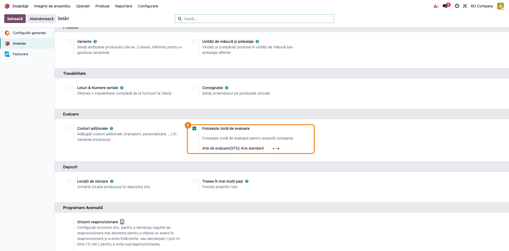
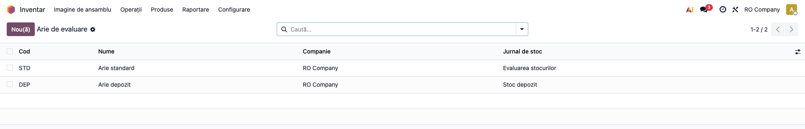
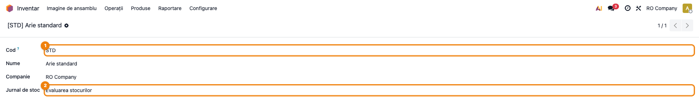
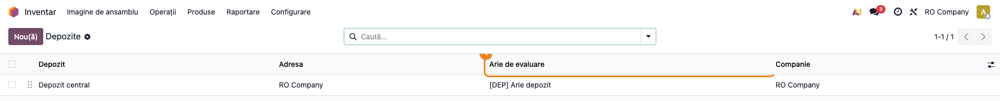
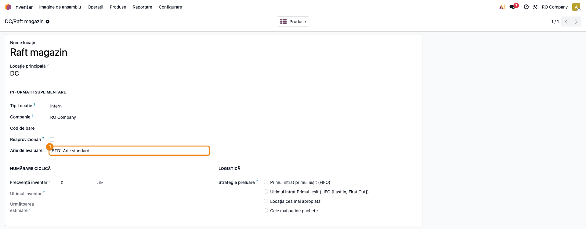
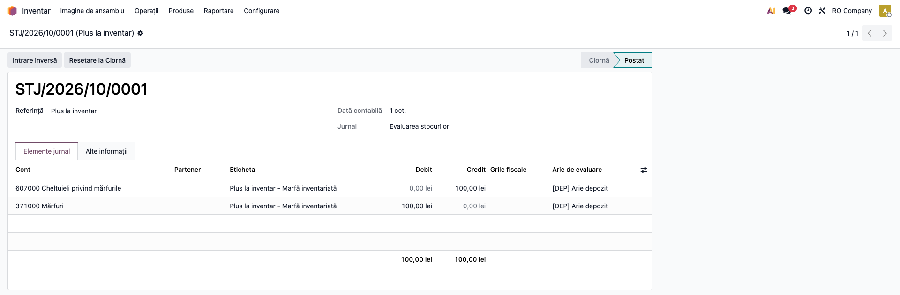
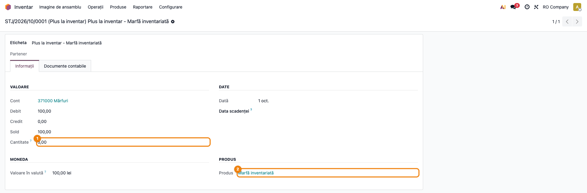
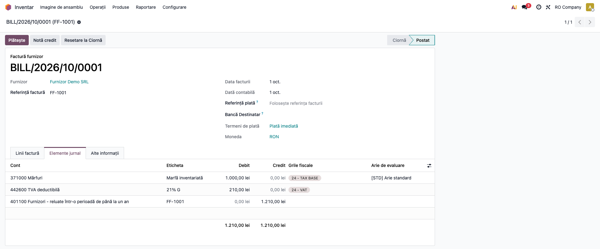

# Fișă Modul: Arii de evaluare a stocului (Valuation Area)

**Modul:** `deltatech_valuation_area`
**Utilizator principal:** contabil stocuri, administrator Odoo, manager depozit
**Prioritate:** 🟡 Medie (infrastructură: are efect complet împreună cu `deltatech_stock_valuation` și/sau `deltatech_obyc`)

> Fișă actualizată la 01.10.2026 față de versiunea din 11.06.2026: interfața modulului e acum
> tradusă în română (etichetele de mai jos sunt cele din interfața RO), aria are un **jurnal de
> stoc propriu** (folosit de `deltatech_obyc`), iar regulile de determinare a ariei au fost
> reverificate pe Odoo 19 (vezi limitările de la secțiunea 11).

---

## 1. Scop business

Modulul introduce **aria de evaluare** — o unitate de evidență a stocului sub nivelul companiei
(conceptul SAP *Valuation Area*): un depozit, o gestiune sau o locație care trebuie urmărită
separat valoric. Aria se stabilește pe companie (implicit), pe depozit sau pe locație internă și
se scrie automat pe liniile notelor contabile care au produs. Pe această etichetă se sprijină
modulele de evaluare pe arie (`deltatech_stock_valuation`, prețul mediu pe arie) și de determinare
a conturilor (`deltatech_obyc`, conturi și jurnal per arie). Folosit singur, modulul **etichetează**
liniile contabile; nu produce rapoarte valorice.

## 2. Bază legală și context

Modulul nu implementează o cerință legală anume. Este un instrument de organizare a evidenței
stocurilor pe gestiuni/arii, util firmelor care țin stocul pe mai multe depozite sau puncte de
lucru și vor evidența valorică separată pe fiecare.

Context de metodă: modulul este proiectat pentru evaluarea la **cost mediu ponderat (AVCO)**.
Ariile agregă liniile contabile pe produs și arie, ceea ce nu păstrează straturile de cost cerute
de **FIFO** — produsele pe FIFO nu sunt suportate de evaluarea pe arii.

## 3. Utilizatori și roluri

| Rol | Ce face | Drepturi necesare |
|---|---|---|
| Administrator Odoo | activează ariile pe companie și alege aria implicită | Administrare / Setări |
| Manager depozit | completează aria pe depozite și locații | Inventar / Administrator (câmpul e vizibil doar acestui grup) |
| Contabil-șef / administrator contabil | definește ariile și jurnalele lor de stoc | Contabilitate / **Administrator** (doar acest grup poate crea, modifica sau șterge arii; ceilalți utilizatori interni le pot doar citi) |
| Contabil stocuri | verifică aria pe notele de stoc și pe facturi | Contabilitate / Contabil; pentru lista **Elemente jurnal** e nevoie de cel puțin drept de citire în Contabilitate |

Pentru testare: un utilizator cu **Inventar / Administrator** + **Contabilitate / Administrator**
acoperă tot fluxul; pentru pasul 1 este nevoie și de drepturi de administrare (Setări). Atenție:
managerul de depozit vede meniul ariilor, dar fără Contabilitate / Administrator nu poate crea arii.

## 4. Conturi și date implicate

| Cont | Rol în demo |
|---|---|
| 371 Mărfuri | contul de stoc al produselor (linia care primește aria și cantitatea semnată) |
| 607 Cheltuieli privind mărfurile | contul de pierderi pus pe locația de ajustare a inventarului (contrapartida notei de stoc automate) |
| 4426 TVA deductibilă | TVA 21% pe factura de furnizor din pasul 8 |
| 401 Furnizori | contrapartida facturii de furnizor din pasul 8 |

Datele minime pentru demo (sunt și cele din capturi):

- compania **RO Company**, plan de conturi RO, monedă RON;
- aria **[STD] Arie standard** (implicită pe companie), pe jurnalul de stoc al companiei
  (**Evaluarea stocurilor**);
- aria **[DEP] Arie depozit**, cu jurnal de stoc propriu (**Stoc depozit**), pusă pe depozitul
  **Depozit central** și pe locația lui de stoc **DC/Stoc**;
- o locație internă separată, **DC/Raft magazin**, cu aria **[STD]**;
- un produs stocabil dintr-o categorie cu evaluarea **Perpetuă (la facturare)**, cost mediu și
  cont de stoc 371, pentru nota de stoc automată și pentru factura de furnizor;
- partenerul **Furnizor Demo SRL**.

## 5. Configurare inițială

1. **Inventar → Configurare → Setări**, secțiunea **Evaluare**: bifați **Folosește zonă de
   evaluare** (pasul 1). Câmpul pentru aria implicită apare sub bifă, dar îl completați abia
   după ce creați ariile (pașii 2–3).
2. **Inventar → Configurare → Zonă de evaluare** (grupul *Gestiunea depozitului*): creați ariile.
3. Reveniți în Setări și alegeți **Arie de evaluare** = aria implicită a companiei; **Salvează**.
4. **Inventar → Configurare → Depozite**: completați **Arie de evaluare** pe depozitele evaluate
   separat (pasul 4).
5. **Inventar → Configurare → Locații** (meniul apare doar cu setarea **Locații de stocare**
   activă): completați **Arie de evaluare** pe locațiile interne — **inclusiv pe locația de stoc
   a fiecărui depozit** (vezi pasul 4 de ce).
6. Pentru ca stocul să genereze note contabile automate (pasul 6): categoria produsului cu
   evaluarea **Perpetuă (la facturare)** și, pe locația de ajustare a inventarului, contul de
   pierderi completat.

## 6. Flux de utilizare

### Pasul 1 — Activarea ariilor pe companie

**Inventar → Configurare → Setări**, secțiunea **Evaluare**. Bifați **Folosește zonă de
evaluare**; sub bifă apare câmpul **Arie de evaluare** — aria implicită a companiei, folosită
când nici locația, nici depozitul nu au arie. Apăsați **Salvează**.

La prima configurare ariile nu există încă: lăsați câmpul gol, creați ariile (pașii 2–3) și
reveniți aici să alegeți aria implicită (vezi secțiunea 5, punctul 3).

Cât timp bifa nu e activă, modulul nu completează și nu cere aria nicăieri. Setarea e per
companie: celelalte companii din bază nu sunt afectate.



### Pasul 2 — Lista ariilor de evaluare

**Inventar → Configurare → Zonă de evaluare**. Lista arată, pentru fiecare arie, **Cod**,
**Nume**, **Companie** și **Jurnal de stoc**. Butonul **Nou(ă)** creează o arie nouă.



### Pasul 3 — Formularul ariei: cod și jurnal de stoc

Deschideți o arie din listă (sau creați una). Completați:

| Câmp | Rol |
|---|---|
| **Cod** ① | cod scurt, obligatoriu; apare în numele afișat `[COD] Nume` (regulile de conturi din `deltatech_obyc` se leagă de arie, nu de cod) |
| **Nume** | denumirea ariei, obligatorie |
| **Companie** | compania căreia îi aparține aria (implicit compania curentă) |
| **Jurnal de stoc** ② | jurnalul pe care se înregistrează notele de stoc ale ariei — **folosit doar dacă este instalat `deltatech_obyc`** |

Numele afișat al ariei are forma **`[COD] Nume`** (ex. „[STD] Arie standard").

Despre **Jurnal de stoc**: cu `deltatech_obyc` instalat, mișcările produselor care au **clasă de
evaluare OBYC** dintr-o arie cu jurnal propriu primesc nota de stoc pe jurnalul ariei; restul
mișcărilor rămân pe jurnalul de stoc al companiei. Fără `deltatech_obyc`, câmpul este doar
informativ: notele de stoc merg mereu pe jurnalul de stoc al companiei (vezi pasul 6, unde aria
[DEP] are jurnalul „Stoc depozit", dar nota e pe „Evaluarea stocurilor").



### Pasul 4 — Aria pe depozit

**Inventar → Configurare → Depozite**. Coloana **Arie de evaluare** (opțională, afișată implicit)
arată aria fiecărui depozit; o completați din formularul depozitului, câmpul **Arie de evaluare**
de lângă adresă. În captură, **Depozit central** are aria **[DEP] Arie depozit**, care înlocuiește
aria implicită a companiei pe mișcările depozitului.

**Atenție:** aria depozitului se aplică doar mișcărilor care **poartă depozitul** — cele generate
din reguli de aprovizionare (ex. livrări din comenzi de vânzare, recepții din comenzi de
achiziție). Ajustările de inventar și transferurile create manual nu poartă depozitul și cad pe
aria implicită a companiei. De aceea completați aceeași arie și pe **locația de stoc** a
depozitului (pasul 5) — așa este configurat și demo-ul (DC/Stoc = [DEP]).



### Pasul 5 — Aria pe locația internă

**Inventar → Configurare → Locații**, deschideți locația. În grupul **Informații suplimentare**,
câmpul **Arie de evaluare** ① (vizibil doar pentru Inventar / Administrator). Aria locației are
**prioritate maximă** și se ia doar pentru locațiile de tip **Intern**.

Aria **nu se moștenește** de la locația părinte: fiecare locație internă (inclusiv sublocațiile,
rafturile) trebuie configurată explicit; o sublocație fără arie cade pe depozit sau pe companie.



### Pasul 6 — Nota de stoc generată automat

Notele contabile generate din mișcările de stoc primesc automat, pe fiecare linie cu produs:

- **aria de evaluare**, determinată în ordinea:
  1. locația destinație, dacă e internă și are arie;
  2. locația sursă, dacă e internă și are arie;
  3. depozitul mișcării (vezi atenționarea de la pasul 4);
  4. aria implicită a companiei;
- **cantitatea, cu semn**: pozitivă pe linia de debit, negativă pe linia de credit;
- **unitatea de măsură** a produsului.

În Odoo 19 standard liniile notelor de stoc nu poartă cantitate; fără completarea automată,
evaluarea pe arii ar pierde cantitățile. În Odoo 19 nota de stoc se generează automat doar pentru
produsele cu evaluare perpetuă și doar la mișcările spre/din locațiile cu cont propriu
(ajustarea de inventar — cont de pierderi, producția — cont de cost); recepțiile și livrările
obișnuite se înregistrează contabil prin facturi (vezi „Facturi" mai jos).

Exemplul din captură: plus de 5 bucăți la inventar pe **DC/Stoc** — nota are aria **[DEP] Arie
depozit** pe ambele linii (aria locației destinație), cantitatea +5 pe linia de debit 371 și −5 pe
linia de credit 607. Coloana **Arie de evaluare** e opțională în lista liniilor: o afișați din
butonul de coloane opționale din capul tabelului. Cantitatea nu are coloană în lista liniilor
notei; o verificați la pasul 7.



### Pasul 7 — Cantitatea semnată pe linia notei de stoc

**Facturare** (sau **Contabilitate**, cu Enterprise) **→ Examinare → Control → Elemente jurnal**, deschideți
linia 371 a notei de la pasul 6. În grupul **Valoare**, câmpul **Cantitate** ① arată **5,00**
(pozitiv, linia e de debit); în grupul **Produs** ② apare produsul. Linia 607 a aceleiași note
are cantitatea **−5,00**. Câmpul e doar de citire. Meniul **Elemente jurnal** cere cel puțin drept
de citire în Contabilitate.

Această cantitate semnată este cea pe care `deltatech_stock_valuation` o agregă pe arie.



### Pasul 8 — Factura de furnizor cu produs stocabil

**Facturare → Furnizori → Facturi**, factura postată, tab-ul **Elemente jurnal**. Pe linia
produsului stocabil, coloana opțională **Arie de evaluare** e completată automat: aria se ia din
mișcarea de stoc legată (recepția comenzii de achiziție, respectiv livrarea comenzii de vânzare
pe facturile de client), altfel din aria implicită a companiei. Liniile fără produs (TVA,
furnizor) rămân fără arie. În captură, factura fără comandă de achiziție primește **[STD] Arie
standard** pe linia 371. Coloana nu există în tab-ul **Linii factură**, doar în **Elemente jurnal**.

În demo factura e fără recepție, ca să arate aria implicită. În practică marfa intră prin
recepția comenzii de achiziție, iar aria vine din locația recepției (pe DC/Stoc ar fi [DEP]).
Factura sosită înaintea mărfii se tratează separat, pe 327 „Mărfuri în curs de aprovizionare”,
nu pe 371.

Cât timp compania folosește ariile, linia cu produs stocabil **nu poate rămâne fără arie**:
golirea ei blochează salvarea cu mesajul de la secțiunea 9. Dacă compania nu are arie implicită
și linia nu are o mișcare legată, chiar alegerea produsului stocabil pe linie e refuzată („Zona de
evaluare nu este definită") — pe facturi și pe orice linie contabilă cu produs, creată de alte
documente.



**Note contabile manuale.** În Odoo 19, lista liniilor unei note contabile introduse manual nu
are coloane pentru produs și cantitate, iar modulul nu le adaugă; o notă manuală nu poate deci
primi produs sau cantitate din interfață, iar aria (care se calculează doar pe liniile cu produs)
nu se completează pe ea. Corecțiile pe arii se fac prin documentele de stoc sau de facturare.

### Note de monografie și raportare

Modulul **nu schimbă conturile** și nici sumele: notele rămân cele din Odoo standard (sau din
`deltatech_obyc`); modulul adaugă pe linii aria, cantitatea semnată și unitatea de măsură.

| Operațiune (demo) | Debit | Credit | Arie pe linii | Cantitate |
|---|---|---|---|---|
| Plus la inventar, 5 buc × 20 lei, pe DC/Stoc (pasul 6) | 371 Mărfuri 100,00 | 607 Cheltuieli privind mărfurile 100,00 | [DEP] pe ambele | +5 pe 371, −5 pe 607 |
| Lipsă la inventar (sens invers) | 607 | 371 | aria locației sursă | +q pe 607, −q pe 371 |
| Factură de furnizor, 10 buc × 100 lei + TVA 21% (pasul 8) | 371 Mărfuri 1.000,00 și 4426 TVA deductibilă 210,00 | 401 Furnizori 1.210,00 | [STD] doar pe linia 371 | 10 (cantitatea facturată) |

Contul 607 pe plus/lipsă la inventar vine din contul de pierderi configurat pe locația de
ajustare (o singură valoare pentru ambele sensuri, în Odoo 19); dacă firma folosește alt cont,
modulul nu îl influențează. Nota de stoc la lipsă acoperă doar scoaterea din gestiune: eventuala
ajustare a TVA dedusă pentru lipsurile nejustificate și imputarea lipsurilor către gestionar se
înregistrează separat, conform Codului fiscal și politicii firmei; nici Odoo, nici modulul nu le
generează.

## 7. Legături cu alte module / declarații

| Modul | Rol |
|---|---|
| `stock_account` (Odoo) | generează notele de stoc pe care modulul le completează cu aria |
| `deltatech_stock_valuation` | calculează valoarea și prețul mediu **pe arie** din liniile etichetate; are nevoie de cantitatea semnată |
| `deltatech_obyc` | determină conturile pe arie + clasă de evaluare și pune nota de stoc pe **Jurnalul de stoc al ariei** |

Nu are legătură directă cu declarații ANAF.

**Ce e automat:** aria, cantitatea semnată și unitatea de măsură pe notele de stoc; aria pe
liniile de factură/notă cu produs stocabil; blocarea liniilor cu produs stocabil fără arie.

**Ce rămâne manual:** definirea ariilor și a jurnalelor; completarea ariei pe fiecare depozit și
pe fiecare locație internă (fără moștenire). Notele contabile manuale nu pot primi produs,
cantitate sau arie din interfață (vezi pasul 8).

## 8. Verificări pentru consultant

- [ ] compania are bifat **Folosește zonă de evaluare** și o **Arie de evaluare** implicită
- [ ] fiecare arie are **Cod** și, dacă se folosește `deltatech_obyc`, **Jurnal de stoc** al aceleiași companii
- [ ] depozitele evaluate separat au aria completată **și** locația lor de stoc are aceeași arie
- [ ] fiecare sublocație internă relevantă are aria setată explicit (nu se moștenește)
- [ ] pe o notă de stoc automată (ex. ajustare de inventar), coloana **Arie de evaluare** arată aria locației, pe toate liniile cu produs
- [ ] în **Elemente jurnal**, linia de debit a notei de stoc are **Cantitate** pozitivă, iar linia de credit cantitate negativă, egală în valoare absolută
- [ ] pe o factură de furnizor cu produs stocabil, tab-ul **Elemente jurnal** arată aria pe linia produsului (aria recepției legate sau, fără comandă, aria implicită)
- [ ] utilizatorul care definește ariile are **Contabilitate / Administrator**
- [ ] produsele evaluate pe arii sunt pe **cost mediu (AVCO)**, nu pe FIFO
- [ ] fără `deltatech_obyc`: notele de stoc sunt pe jurnalul de stoc al companiei, indiferent de jurnalul ariei (comportament așteptat)

## 9. Mesaje de eroare frecvente

| Mesaj | Cauză | Remediere |
|---|---|---|
| „Zona de evaluare este obligatorie pentru produsele stocabile. Dacă produsul nu este stocabil, o puteți lăsa necompletată." | pe o linie de notă/factură cu produs stocabil s-a golit **Arie de evaluare**, iar compania folosește ariile | completați aria pe linie |
| „Zona de evaluare nu este definită" | compania folosește ariile, dar nu are arie implicită, iar linia (sau mișcarea) nu găsește arie pe locație/depozit; apare chiar la alegerea produsului stocabil pe linia unei facturi | alegeți aria implicită în Setări (pasul 1) sau completați aria pe locație/depozit |
| „Locațiile sursă și destinație trebuie să aibă aceeași zonă de evaluare pentru mișcările interne." | se determină aria unei mișcări între două locații interne cu arii diferite (vezi limitarea de la secțiunea 11) | păstrați sursa și destinația în aceeași arie sau treceți transferul printr-o locație de tranzit |

## 10. Capturi de ecran

Capturile din `readme/screenshots/` sunt **generate automat** din `tests/test_screenshots.py`
(mixinul `ScreenshotCase` din `l10n_ro_doc_screenshots`, import defensiv), în **limba română**, pe
„RO Company", în RON, pe planul de conturi RO (`setup_country("ro")`), în ordinea pașilor:

1. `01_setari_use_valuation_area.png` — Setări Inventar, secțiunea Evaluare: bifa și aria implicită.
2. `02_valuation_area_list.png` — lista ariilor cu Cod / Nume / Companie / Jurnal de stoc.
3. `03_valuation_area_form.png` — formularul ariei [STD], cu Cod și Jurnal de stoc evidențiate.
4. `04_depozit_valuation_area.png` — lista depozitelor, coloana Arie de evaluare ([DEP]).
5. `05_locatie_valuation_area.png` — formularul locației DC/Raft magazin, câmpul Arie de evaluare.
6. `06_nota_stoc_automata.png` — nota de stoc automată la plus de inventar (Dr 371 / Cr 607, aria [DEP]).
7. `07_linie_stoc_cantitate.png` — formularul liniei 371 a notei automate: Cantitate 5,00 și Produs.
8. `08_factura_furnizor_valuation_area.png` — factura de furnizor (Dr 371 + 4426 / Cr 401), aria [STD] pe linia produsului.

Regenerare:

```bash
./odoo/odoo-bin -c odoo.conf -d <db> -i l10n_ro,deltatech_valuation_area,l10n_ro_doc_screenshots \
    --without-demo=all --test-tags=fise_screenshots --stop-after-init --http-port=8170
```

## 11. Observații pentru manual

- **Terminologie:** interfața RO folosește atât „zonă de evaluare" (meniul, bifa din Setări,
  mesajele de eroare), cât și „arie de evaluare" (câmpurile, titlul listei). Sunt același lucru;
  manualul poate folosi „arie de evaluare" și menționa că meniul se numește „Zonă de evaluare".
- **Blocarea transferurilor interne între arii** se verifică doar când se determină aria
  mișcării. Cu acest modul singur, un transfer intern simplu între două locații interne nu
  generează notă în Odoo 19, deci **nu este blocat** (verificat pe 01.10.2026). Cu
  `deltatech_obyc` instalat, pentru produsele cu clasă de evaluare OBYC, aria se determină la
  validarea transferului, deci validarea între arii diferite este refuzată (dedus din cod,
  neverificat încă pe o bază de test). Nu prezentați blocarea ca garanție în afara acestui caz;
  recomandați păstrarea sursei și destinației în aceeași arie. Suportul complet pentru transferuri între arii este planificat (roadmap evaluare
  pe depozit).
- **Aria depozitului** se aplică doar mișcărilor care poartă depozitul (din reguli de
  aprovizionare); pentru restul, aria trebuie pusă pe locația de stoc.
- **Jurnalul de stoc al ariei** are efect doar cu `deltatech_obyc` și doar pentru produsele cu
  clasă de evaluare OBYC.
- Modulul este infrastructură: nu livrează singur rapoarte valorice; valoarea pe arie o calculează
  `deltatech_stock_valuation`.
- Metoda suportată este **AVCO**; produsele pe FIFO nu sunt compatibile cu evaluarea pe arii.
